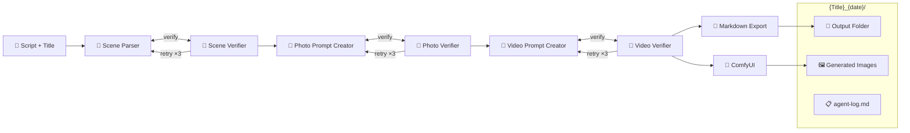

# AI Script to Media (.NET)

A multi-agent AI system that transforms text scripts into visual media (images) using local AI models.

## Overview

This tool accepts a script title and text as input and automatically:
1. Parses the script into discrete scenes
2. Validates scene breakdown for correctness
3. Generates detailed image prompts for each scene
4. Generates video prompts for each scene (reference only, no generation)
5. Produces images using ComfyUI
6. Exports all artifacts to a structured output folder

## Input

| Field | Type | Description |
|-------|------|-------------|
| `Title` | string | Script title (used for output folder naming) |
| `Script` | string | Full script text |

## Output

Creates a folder named `{Title}_{YYYY-MM-DD_HH-mm-ss}` containing:

```
{Title}_{date}/
├── script.md              # Original script
├── scenes.md              # Parsed scenes with descriptions
├── photo-prompts.md       # Image generation prompts per scene
├── video-prompts.md       # Video prompts per scene (reference only)
├── agent-log.md           # Detailed agent execution log
└── images/
    ├── scene-001-prompt-001.png
    ├── scene-001-prompt-002.png
    └── ...
```

### Agent Log

The `agent-log.md` and `execution-log.md` files capture:
- Each agent's execution timestamp
- Input/output summaries
- Retry attempts with reasons
- Feedback messages between verifier and creator agents
- Validation errors and corrections
- Final decisions at each stage
- Configuration snapshot for reproduction
- Full stack traces for errors

## Architecture

### Project Structure

```
AIScriptToMediaDotNet/
├── src/
│   ├── AIScriptToMediaDotNet.Core/        # Shared kernel (interfaces, options)
│   ├── AIScriptToMediaDotNet.Providers/   # AI providers (Ollama, future: OpenAI, Anthropic)
│   ├── AIScriptToMediaDotNet.Agents/      # Agent implementations (vertical slices)
│   ├── AIScriptToMediaDotNet.Services/    # External services (ComfyUI, Export)
│   └── AIScriptToMediaDotNet.App/         # Composition root (entry point)
│
├── tests/
│   ├── AIScriptToMediaDotNet.Core.Tests/
│   ├── AIScriptToMediaDotNet.Providers.Tests/
│   ├── AIScriptToMediaDotNet.Agents.Tests/
│   └── AIScriptToMediaDotNet.Integration.Tests/
│
└── docs/
```

### Multi-Agent Pipeline

Multi-agent pipeline with verification loops:



Each verification stage has up to 3 retry attempts before proceeding.

## Key Features

- **Local-First AI**: Uses Ollama for all AI agent inference (privacy, no API costs)
- **Multi-Agent System**: Specialized agents for parsing, creation, and verification
- **Verification Loops**: Creator-Verifier pattern ensures quality output (3 retries max)
- **ComfyUI Integration**: Generates images from photo prompts only
- **Video Prompts**: Created for reference/planning (no video generation)
- **Extensible**: Designed for future cloud AI provider support (OpenAI, Anthropic, etc.)
- **Markdown Export**: All prompts saved with scene references
- **Detailed Logging**: Agent execution log with retries, feedback, and decisions

## Prerequisites

- [.NET 10 SDK](https://dotnet.microsoft.com/download)
- [Ollama](https://ollama.ai) running locally (default: `http://localhost:11434`)
- [ComfyUI](https://github.com/comfyanonymous/ComfyUI) running locally
- Recommended Ollama models: Configure via `appsettings.json` (e.g., `lfm2.5-thinking`, `llama3.1`, `llava`, or similar capable models)

## Quick Start

```bash
# Clone and build
dotnet build

# Run tests
dotnet test

# Run the application (from src/AIScriptToMediaDotNet.App directory)
cd src/AIScriptToMediaDotNet.App
dotnet run -- --title "My Script" --input script.txt --output ./output

# Or run from solution root
dotnet run --project src/AIScriptToMediaDotNet.App -- --title "My Script" --input script.txt --output ./output

# Output: ./output/My Script_2026-02-23_14-30-00/
```

## Configuration

Configuration via `appsettings.json` or environment variables:

| Setting | Default | Description |
|---------|---------|-------------|
| `OllamaEndpoint` | `http://localhost:11434` | Ollama API endpoint |
| `ComfyUIEndpoint` | `http://localhost:8188` | ComfyUI API endpoint |
| `MaxRetries` | `3` | Max verification retry attempts |
| `OutputPath` | `./output` | Default output directory |

## Documentation

- [Backlog](docs/backlog.md) - Feature roadmap and user stories
- [Running Book](docs/running-book.md) - Detailed setup and troubleshooting
- [Context Schema](docs/context-schema.md) - Data structures and contracts
- [Architecture Decisions](docs/adr/) - Technical decision records

## Project Status

**Alpha** - Core architecture in development

See [backlog](docs/backlog.md) for planned features.

## License

MIT
