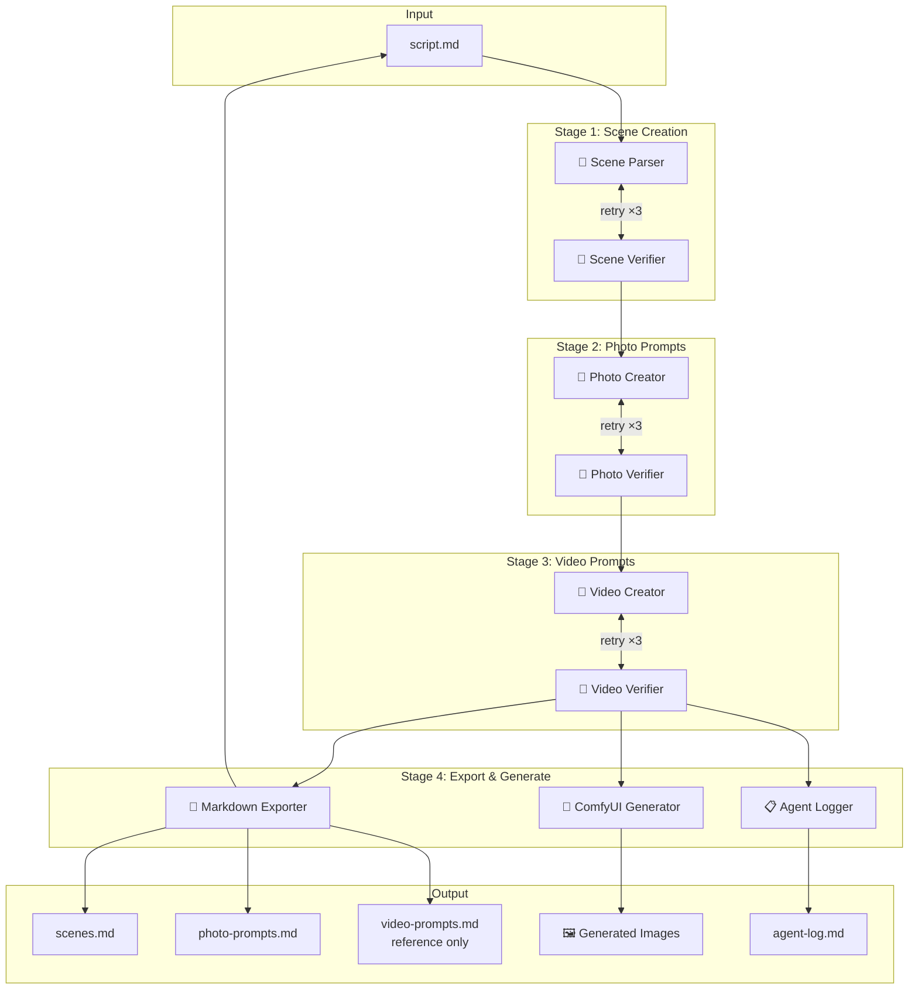
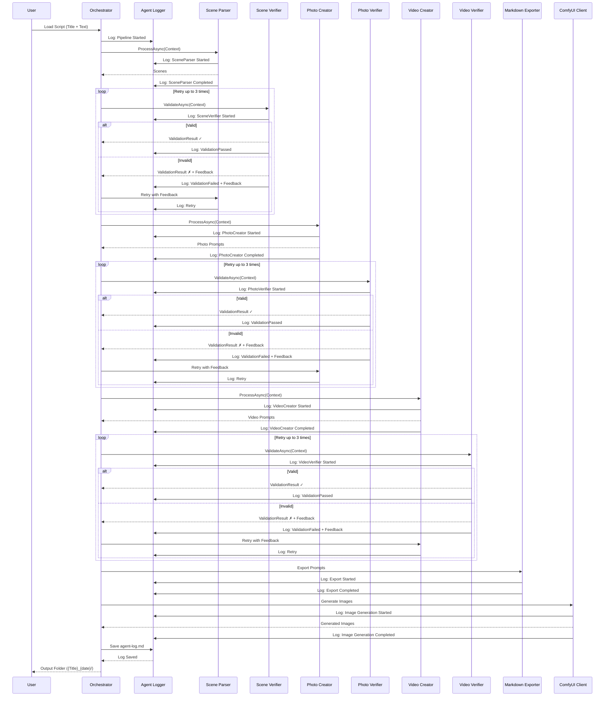
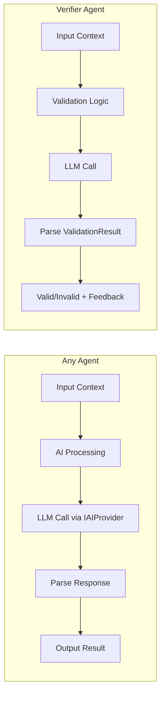

# ADR-001: Architecture Overview

**Status**: Accepted  
**Date**: 2026-02-23  
**Author**: Development Team

---

## Context

We are building a multi-agent AI system that transforms text scripts into visual media (images and videos). The system needs to:

1. Parse scripts into scenes
2. Generate image and video prompts
3. Validate outputs at each stage
4. Generate images using ComfyUI
5. Support local AI (Ollama) with future cloud provider options

## Decision

We will use an **Orchestrator-Based Multi-Agent Pipeline** architecture with the following characteristics:

### Pipeline Stages

### Component Interaction

### Agent Flow Detail

### Agent Pattern

Each agent follows a consistent pattern:
- Receives `ScriptToMediaContext`
- Performs specific transformation/validation
- Returns result with success/failure status
- Verifiers provide feedback for retries

### Output Structure

All output is saved to a folder named `{ScriptTitle}_{YYYY-MM-DD_HH-mm-ss}/`:

| File | Description |
|------|-------------|
| `script.md` | Original input script |
| `scenes.md` | Parsed scenes with metadata |
| `photo-prompts.md` | Image generation prompts per scene |
| `video-prompts.md` | Video prompts per scene (reference only, no generation) |
| `agent-log.md` | Detailed agent execution log |
| `images/` | Generated images from ComfyUI |

**Note**: Video prompts are created for future reference and planning purposes only. Version 1 does not generate videos.

## Consequences

### Positive

- **Clear separation of concerns**: Each agent has single responsibility
- **Quality gates**: Verifier agents catch errors early
- **Retry resilience**: Automatic correction attempts
- **Extensibility**: Easy to add new agents or stages
- **Testability**: Agents can be tested in isolation
- **Provider flexibility**: Swap AI backends per-agent or globally

### Negative

- **Complexity**: More components than simple linear pipeline
- **Latency**: Multiple AI calls per stage increases total time
- **State management**: Shared context must be carefully managed
- **Debugging**: Harder to trace issues across multiple agents

### Risks Mitigated

| Risk | Mitigation |
|------|------------|
| AI produces poor output | Verifier agents + retry loop |
| Local AI too slow | Configurable models, future cloud option |
| ComfyUI unavailable | Client handles errors, continues pipeline |
| Context corruption | Immutable snapshots, validation at each stage |

---

## Alternatives Considered

### Option 1: Single Monolithic Agent
One AI handles everything in one call.

**Rejected because**:
- No quality control
- Hard to debug failures
- No retry granularity
- Less control over output format

### Option 2: Event-Driven Architecture
Agents communicate via events/message bus.

**Rejected because**:
- Over-engineering for current scope
- Adds infrastructure complexity
- Harder to maintain execution order
- Debugging distributed flows is complex

### Option 3: Functional Pipeline
Pure functional transformations (F# style).

**Rejected because**:
- Less flexible for retry logic
- Harder to inject cross-cutting concerns (logging, metrics)
- Team more comfortable with OOP

---

## Compliance

This decision aligns with:
- Local-first AI requirement (Ollama)
- Future cloud provider extensibility
- Quality verification requirements
- Retry mechanism requirements (3 attempts)

---

## Notes

- Architecture may evolve as implementation reveals challenges
- Core pattern (orchestrator + agents) should remain stable
- Future: Consider parallel execution for photo/video prompt stages
