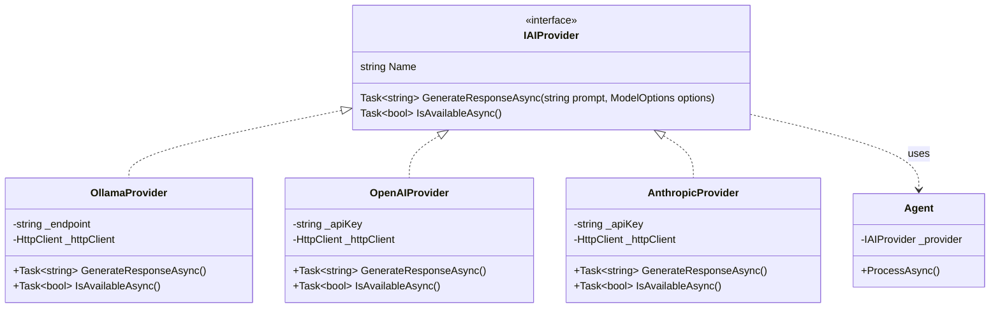
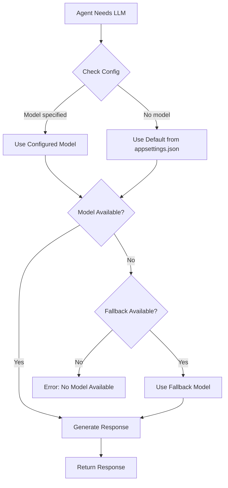

# ADR-002: Ollama as Local LLM Provider

**Status**: Accepted  
**Date**: 2026-02-23  
**Author**: Development Team

---

## Context

We need an AI/LLM provider for all agent inference. Requirements:

1. **Local execution** for privacy and no API costs
2. **Model flexibility** to choose different models per task
3. **Future cloud option** for higher quality when needed
4. **Simple API** for easy integration
5. **Cross-platform** support (Windows, macOS, Linux)

## Decision

We will use **Ollama** as the primary local LLM provider.

### Provider Architecture



### Model Selection Flow



### Provider Interface

```csharp
public interface IAIProvider
{
    string Name { get; }
    Task<string> GenerateResponseAsync(string prompt, ModelOptions options);
    Task<bool> IsAvailableAsync();
}

public class OllamaProvider : IAIProvider
{
    public string Name => "Ollama";
    
    public async Task<string> GenerateResponseAsync(string prompt, ModelOptions options)
    {
        // HTTP call to Ollama API
    }
}
```

### Recommended Models

| Task | Model | Rationale |
|------|-------|-----------|
| All agents (default) | Configure in `appsettings.json` | Good balance of speed/quality |
| Fast iteration | `mistral:7b` | Faster, decent quality |
| Best quality | Configure larger model in `appsettings.json` | Slower, higher quality |
| Resource constrained | `phi3:mini` | Very fast, minimal RAM |

> **Note**: Model names are configured in `appsettings.json` under `Ollama:DefaultModel` and `Ollama:AgentModels`.

## Consequences

### Positive

- **Privacy**: All processing stays local
- **No API costs**: Free after initial hardware
- **Model choice**: Easy to swap models per agent
- **Simple API**: REST-based, easy to integrate
- **Active development**: Ollama team regularly updates
- **Cross-platform**: Works on Windows, macOS, Linux

### Negative

- **Hardware dependent**: Quality limited by local GPU/RAM
- **Setup required**: Users must install Ollama separately
- **Model management**: Users must download models manually
- **Performance**: Slower than cloud APIs on modest hardware

### Trade-offs

| Factor | Ollama | Cloud (OpenAI, etc.) |
|--------|--------|---------------------|
| Cost | Free | Pay per token |
| Privacy | Full | Data sent to provider |
| Quality | Good (limited by model) | Excellent (GPT-4, Claude) |
| Speed | Hardware dependent | Generally fast |
| Setup | Required | API key only |

## Alternatives Considered

### Option 1: LM Studio
Local LLM runner with API.

**Rejected because**:
- Less mature than Ollama
- Smaller model library
- Less active development

### Option 2: Direct HuggingFace Transformers
Run models directly via Transformers library.

**Rejected because**:
- More complex setup
- Requires Python environment
- More code to maintain
- Harder model management

### Option 3: OpenAI API (Primary)
Use OpenAI as primary provider.

**Rejected because**:
- Violates local-first requirement
- Ongoing costs
- Privacy concerns for some users

### Option 4: vLLM
High-performance local inference server.

**Rejected because**:
- More complex setup
- Primarily for production deployments
- Overkill for our use case

---

## Implementation Notes

### HTTP Client Configuration

```csharp
// Timeout settings
HttpClient.Timeout = TimeSpan.FromMinutes(2); // Long prompts take time

// Retry policy
Policy.Handle<HttpRequestException>()
      .WaitAndRetryAsync(3, _ => TimeSpan.FromSeconds(5));
```

### Model Fallback Strategy

If preferred model unavailable, configure fallback in `appsettings.json`:

```json
{
  "Ollama": {
    "DefaultModel": "lfm2.5-thinking",
    "AgentModels": {
      "DefaultModel": "mistral"
    }
  }
}
```

### Future Cloud Provider

Architecture supports adding:
```csharp
public class OpenAIProvider : IAIProvider { }
public class AnthropicProvider : IAIProvider { }
```

Provider selection via configuration:
```json
{
  "ActiveProvider": "Ollama", // or "OpenAI", "Anthropic"
  "Providers": {
    "Ollama": { "Endpoint": "..." },
    "OpenAI": { "ApiKey": "..." }
  }
}
```

---

## Migration Path

If Ollama becomes unsuitable:

1. Implement alternative `IAIProvider` (e.g., `LMStudioProvider`)
2. Update configuration schema
3. Add provider selection logic
4. Test all agents with new provider
5. Update documentation

The `IAIProvider` abstraction minimizes code changes.

---

## References

- Ollama: https://ollama.ai
- Ollama API: https://github.com/ollama/ollama/blob/main/docs/api.md
- Model library: https://ollama.ai/library
