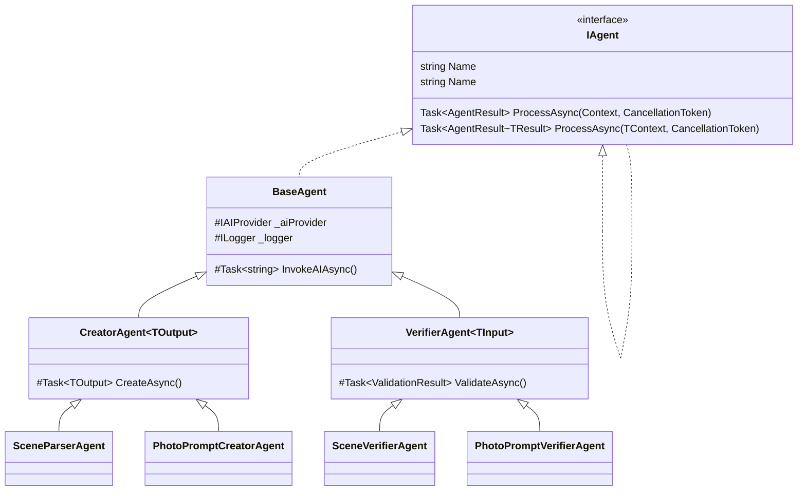
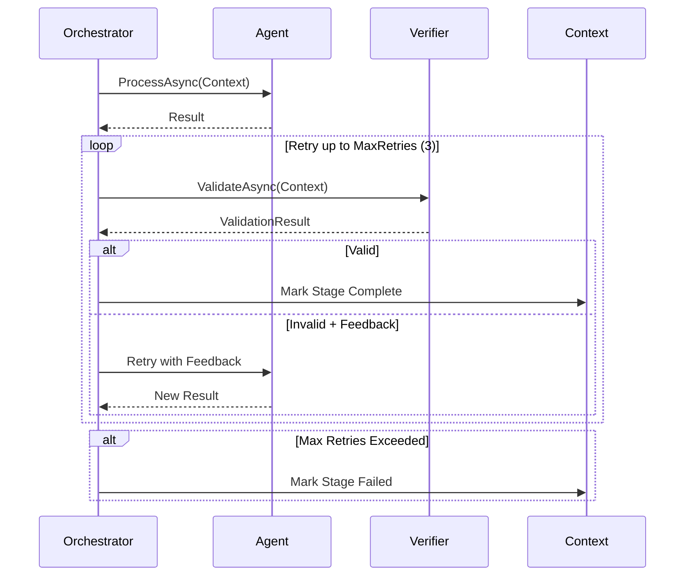

# ADR-003: Agent Interface Design

**Status**: Accepted  
**Date**: 2026-02-23  
**Author**: Development Team

---

## Context

We need a consistent interface for all agents in the pipeline. Requirements:

1. **Uniform contract**: All agents should have consistent input/output
2. **Generic support**: Different agents process different data types
3. **Error handling**: Standardized error reporting
4. **Validation support**: Verifier agents need different contract than creators
5. **Async execution**: All agents run asynchronously
6. **Testability**: Easy to mock for unit tests

## Decision

We will use a **generic interface pattern** with specialized base classes.

### Interface Hierarchy



### Core Interface

```csharp
public interface IAgent<in TContext, out TResult>
{
    string Name { get; }
    Task<AgentResult<TResult>> ProcessAsync(TContext context, CancellationToken ct = default);
}

// Simplified for context-based pipeline
public interface IAgent
{
    string Name { get; }
    Task<AgentResult> ProcessAsync(ScriptToMediaContext context, CancellationToken ct = default);
}
```

### Result Types

```csharp
public class AgentResult
{
    public bool Success { get; set; }
    public List<string> Errors { get; set; } = new();
    public List<string> Warnings { get; set; } = new();
    public TimeSpan ExecutionTime { get; set; }
    public Dictionary<string, object?> Metadata { get; set; } = new();
    
    public static AgentResult Ok() => new() { Success = true };
    public static AgentResult Fail(string error) => new() { Success = false, Errors = { error } };
}

public class AgentResult<T> : AgentResult
{
    public T? Data { get; set; }
    
    public static AgentResult<T> Ok(T data) => new() { Success = true, Data = data };
    public static AgentResult<T> Fail(string error) => new() { Success = false, Errors = { error } };
}
```

### Validation Result (for Verifier Agents)

```csharp
public class ValidationResult
{
    public bool IsValid { get; set; }
    public List<string> Errors { get; set; } = new();
    public List<string> Warnings { get; set; } = new();
    public string? Feedback { get; set; } // Instructions for correction
    
    public static ValidationResult Pass() => new() { IsValid = true };
    public static ValidationResult Fail(string error, string? feedback = null) 
        => new() { IsValid = false, Errors = { error }, Feedback = feedback };
}
```

### Base Classes

```csharp
public abstract class BaseAgent : IAgent
{
    public abstract string Name { get; }
    
    protected readonly IAIProvider _aiProvider;
    protected readonly ILogger<BaseAgent> _logger;
    
    protected BaseAgent(IAIProvider aiProvider, ILogger<BaseAgent> logger)
    {
        _aiProvider = aiProvider;
        _logger = logger;
    }
    
    public abstract Task<AgentResult> ProcessAsync(
        ScriptToMediaContext context, 
        CancellationToken ct = default);
    
    protected async Task<string> InvokeAIAsync(string prompt, string model, CancellationToken ct)
    {
        // Common AI invocation logic with logging, timing, error handling
    }
}

public abstract class CreatorAgent<TOutput> : BaseAgent
{
    public abstract Task<TOutput> CreateAsync(ScriptToMediaContext context, CancellationToken ct);
    
    // Common creation logic, JSON parsing, validation
}

public abstract class VerifierAgent<TInput> : BaseAgent
{
    public abstract Task<ValidationResult> ValidateAsync(
        TInput input, 
        ScriptToMediaContext context, 
        CancellationToken ct);
    
    // Common validation logic, feedback generation
}
```

### Example: Scene Parser Agent

```csharp
public class SceneParserAgent : CreatorAgent<List<Scene>>
{
    public override string Name => "SceneParser";
    
    public SceneParserAgent(IAIProvider aiProvider, ILogger<SceneParserAgent> logger)
        : base(aiProvider, logger) { }
    
    public override async Task<AgentResult> ProcessAsync(
        ScriptToMediaContext context, 
        CancellationToken ct)
    {
        var prompt = BuildSceneParsingPrompt(context.OriginalScript);
        
        var response = await InvokeAIAsync(prompt, "llama3.1", ct);
        
        var scenes = ParseScenesFromResponse(response);
        
        context.Scenes = scenes;
        
        return AgentResult.Ok(scenes);
    }
    
    public override async Task<List<Scene>> CreateAsync(
        ScriptToMediaContext context, 
        CancellationToken ct)
    {
        // Implementation
    }
}
```

### Example: Scene Verifier Agent

```csharp
public class SceneVerifierAgent : VerifierAgent<List<Scene>>
{
    public override string Name => "SceneVerifier";
    
    public SceneVerifierAgent(IAIProvider aiProvider, ILogger<SceneVerifierAgent> logger)
        : base(aiProvider, logger) { }
    
    public override async Task<AgentResult> ProcessAsync(
        ScriptToMediaContext context, 
        CancellationToken ct)
    {
        var validationResult = await ValidateAsync(context.Scenes, context, ct);
        
        context.SceneValidation = validationResult;
        
        return validationResult.IsValid 
            ? AgentResult.Ok() 
            : AgentResult.Fail(string.Join("; ", validationResult.Errors));
    }
    
    public override async Task<ValidationResult> ValidateAsync(
        List<Scene> scenes, 
        ScriptToMediaContext context, 
        CancellationToken ct)
    {
        var prompt = BuildSceneVerificationPrompt(context.OriginalScript, scenes);
        
        var response = await InvokeAIAsync(prompt, "llama3.1", ct);
        
        return ParseValidationResult(response);
    }
}
```

### Retry Sequence



## Consequences

### Positive

- **Consistency**: All agents follow same pattern
- **Type safety**: Generics provide compile-time checking
- **Testability**: Interfaces easy to mock
- **Reusability**: Base classes reduce boilerplate
- **Extensibility**: Easy to add new agent types
- **Clear contracts**: Input/output types explicit

### Negative

- **Complexity**: More types/interfaces than simple functions
- **Boilerplate**: Base classes add some overhead
- **Learning curve**: New developers must understand pattern

### Trade-offs

| Approach | Pros | Cons |
|----------|------|------|
| **Generic Interface** (chosen) | Type-safe, testable, consistent | More types, some boilerplate |
| **Simple Functions** | Less code, simpler | Harder to test, no consistency |
| **Delegate-based** | Flexible, lightweight | Less discoverable, harder to document |

---

## Retry Integration

Orchestrator handles retries, agents don't need retry logic:

```csharp
public class Orchestrator
{
    private const int MaxRetries = 3;
    
    public async Task<AgentResult> ExecuteWithRetryAsync(
        IAgent agent, 
        ScriptToMediaContext context,
        Func<ScriptToMediaContext, bool> shouldRetry,
        CancellationToken ct)
    {
        for (int i = 0; i < MaxRetries; i++)
        {
            var result = await agent.ProcessAsync(context, ct);
            
            if (result.Success || !shouldRetry(context))
                return result;
            
            // Retry - context contains feedback from verifier
            _logger.LogWarning("Retry {RetryCount} for agent {AgentName}", i + 1, agent.Name);
        }
        
        return AgentResult.Fail($"Max retries ({MaxRetries}) exceeded for {agent.Name}");
    }
}
```

---

## Testing Strategy

### Unit Test Example

```csharp
public class SceneParserAgentTests
{
    [Fact]
    public async ProcessAsync_WithValidScript_ReturnsScenes()
    {
        // Arrange
        var mockProvider = new Mock<IAIProvider>();
        mockProvider.Setup(x => x.GenerateResponseAsync(It.IsAny<string>(), It.IsAny<ModelOptions>()))
                    .ReturnsAsync(MockJsonResponse);
        
        var agent = new SceneParserAgent(mockProvider.Object, NullLogger.Instance);
        var context = new ScriptToMediaContext { OriginalScript = "FADE IN:..." };
        
        // Act
        var result = await agent.ProcessAsync(context, CancellationToken.None);
        
        // Assert
        Assert.True(result.Success);
        Assert.NotEmpty(result.Data);
    }
}
```

---

## References

- .NET Generic Interfaces: https://learn.microsoft.com/dotnet/csharp/programming-guide/generics/
- Async Best Practices: https://learn.microsoft.com/dotnet/csharp/async
