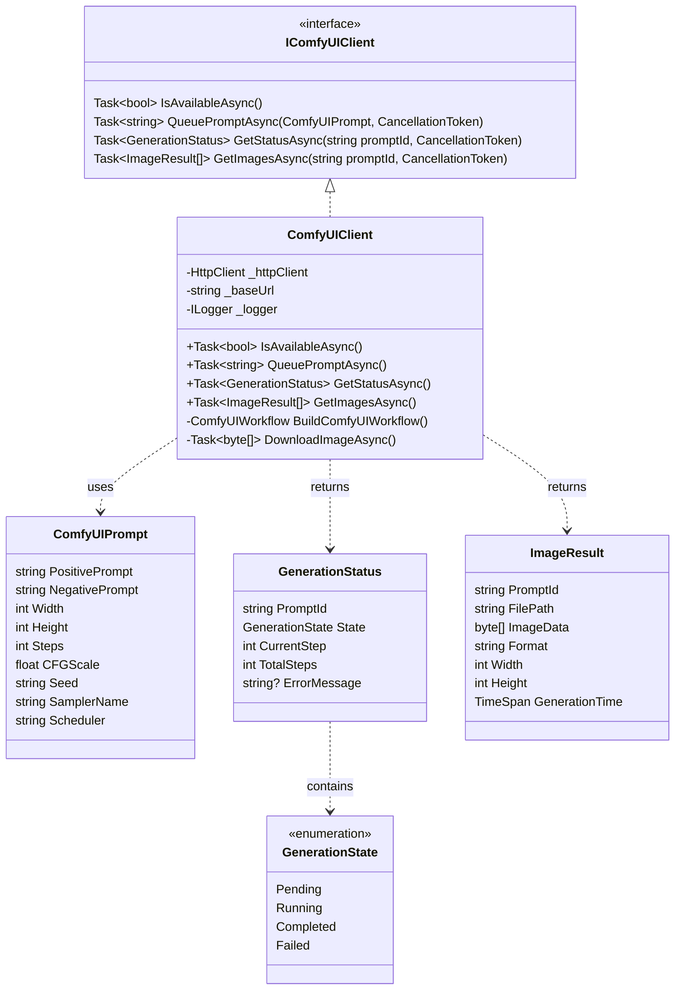

# ADR-004: ComfyUI Integration Approach

**Status**: Accepted  
**Date**: 2026-02-23  
**Author**: Development Team

---

## Context

We need to integrate with ComfyUI for image generation. Requirements:

1. **Local integration**: ComfyUI runs locally
2. **API-based**: No direct code integration needed
3. **Queue management**: Handle multiple image generations
4. **Progress tracking**: Monitor generation status
5. **Error handling**: Handle failures gracefully
6. **Output management**: Save generated images to correct locations

## Decision

We will integrate with ComfyUI via its **REST API** using a dedicated client service.

### Architecture

```mermaid
flowchart TB
    subgraph Application["Application Layer"]
        Agent[Image Generation Agent]
        Client[ComfyUI Client]
    end
    
    subgraph API["ComfyUI REST API"]
        Queue[POST /prompt]
        Status[GET /history/{id}]
        Image[GET /view/{filename}]
    end
    
    subgraph ComfyUI["ComfyUI Server"]
        QueueMgr[Queue Manager]
        Executor[Node Executor]
        Output[Image Output]
    end
    
    subgraph Storage["File System"]
        Images[Generated Images/]
    end
    
    Agent --> Client
    Client -->|Queue Prompt| Queue
    Client -->|Check Status| Status
    Client -->|Download Image| Image
    Queue --> QueueMgr
    Status --> QueueMgr
    Image --> Output
    QueueMgr --> Executor
    Executor --> Output
    Output --> Images
```

### Component Interaction

### Component Interaction

```mermaid
sequenceDiagram
    participant Agent as Image Generation Agent
    participant Client as ComfyUI Client
    participant API as ComfyUI API
    participant Storage as File System
    
    Agent->>Client: GenerateAsync(Context)
    loop For each Photo Prompt
        Agent->>Client: QueuePromptAsync(ComfyUIPrompt)
        Client->>API: POST /prompt
        API-->>Client: { promptId: "abc123" }
        Client-->>Agent: promptId
        
        loop Wait for Completion
            Agent->>Client: GetStatusAsync(promptId)
            Client->>API: GET /history/{promptId}
            API-->>Client: { status: "running" | "completed" }
            Client-->>Agent: GenerationStatus
            alt Completed
                break
            else Failed
                Agent->>Agent: Handle Error
                break
            end
        end
        
        Agent->>Client: GetImagesAsync(promptId)
        Client->>API: GET /view/{filename}
        API-->>Client: Image Bytes
        Client-->>Agent: ImageResult[]
        
        Agent->>Storage: Save Image
        Note over Storage: images/scene-001-prompt-001.png
    end
    Agent-->>Context: GeneratedImages
```

### Client Interface



### Client Implementation

```csharp
public class ComfyUIClient : IComfyUIClient
{
    private readonly HttpClient _httpClient;
    private readonly string _baseUrl;
    private readonly ILogger<ComfyUIClient> _logger;
    
    public ComfyUIClient(HttpClient httpClient, string baseUrl, ILogger<ComfyUIClient> logger)
    {
        _httpClient = httpClient;
        _baseUrl = baseUrl; // e.g., "http://localhost:8188"
        _logger = logger;
    }
    
    public async Task<bool> IsAvailableAsync(CancellationToken ct = default)
    {
        try
        {
            var response = await _httpClient.GetAsync($"{_baseUrl}/system_stats", ct);
            return response.IsSuccessStatusCode;
        }
        catch
        {
            return false;
        }
    }
    
    public async Task<string> QueuePromptAsync(ComfyUIPrompt prompt, CancellationToken ct = default)
    {
        var workflow = BuildComfyUIWorkflow(prompt);
        
        var content = new StringContent(
            JsonSerializer.Serialize(workflow), 
            Encoding.UTF8, 
            "application/json");
        
        var response = await _httpClient.PostAsync($"{_baseUrl}/prompt", content, ct);
        response.EnsureSuccessStatusCode();
        
        var result = await response.Content.ReadFromJsonAsync<QueueResponse>(ct);
        return result.PromptId;
    }
    
    public async Task<GenerationStatus> GetStatusAsync(string promptId, CancellationToken ct = default)
    {
        var response = await _httpClient.GetAsync($"{_baseUrl}/history/{promptId}", ct);
        response.EnsureSuccessStatusCode();
        
        var history = await response.Content.ReadFromJsonAsync<HistoryResponse>(ct);
        
        // Parse status from history response
        return ConvertToStatus(history);
    }
    
    public async Task<ImageResult[]> GetImagesAsync(string promptId, CancellationToken ct = default)
    {
        var history = await GetHistoryAsync(promptId, ct);
        
        var images = new List<ImageResult>();
        
        foreach (var output in history.Outputs.Values)
        {
            if (output.Images != null)
            {
                foreach (var image in output.Images)
                {
                    var imageData = await DownloadImageAsync(image.Filename, image.Subfolder, ct);
                    images.Add(new ImageResult
                    {
                        PromptId = promptId,
                        ImageData = imageData,
                        Format = Path.GetExtension(image.Filename).TrimStart('.'),
                    });
                }
            }
        }
        
        return images.ToArray();
    }
    
    private ComfyUIWorkflow BuildComfyUIWorkflow(ComfyUIPrompt prompt)
    {
        // Build ComfyUI workflow JSON (node-based graph)
        // This is the standard ComfyUI API format
        return new ComfyUIWorkflow
        {
            Prompt = prompt.PositivePrompt,
            NegativePrompt = prompt.NegativePrompt,
            Width = prompt.Width,
            Height = prompt.Height,
            Steps = prompt.Steps,
            CFGScale = prompt.CFGScale,
            Seed = prompt.Seed,
            SamplerName = prompt.SamplerName,
            Scheduler = prompt.Scheduler
        };
    }
}
```

### Image Generation Agent

```csharp
public class ImageGenerationAgent : BaseAgent
{
    public override string Name => "ImageGenerator";
    
    private readonly IComfyUIClient _comfyUIClient;
    private readonly string _outputPath;
    
    public ImageGenerationAgent(
        IComfyUIClient comfyUIClient,
        IAIProvider aiProvider,
        ILogger<ImageGenerationAgent> logger,
        string outputPath)
        : base(aiProvider, logger)
    {
        _comfyUIClient = comfyUIClient;
        _outputPath = outputPath;
    }
    
    public override async Task<AgentResult> ProcessAsync(
        ScriptToMediaContext context, 
        CancellationToken ct)
    {
        if (!_comfyUIClient.IsAvailableAsync(ct).Result)
        {
            return AgentResult.Fail("ComfyUI is not available");
        }
        
        var results = new List<ImageGenerationResult>();
        
        foreach (var photoPrompt in context.PhotoPrompts)
        {
            var comfyPrompt = new ComfyUIPrompt
            {
                PositivePrompt = photoPrompt.Description,
                NegativePrompt = string.Join(", ", photoPrompt.NegativePrompts.Values),
                Width = 1024,
                Height = 1024,
                Steps = 20,
                CFGScale = 7.0f
            };
            
            try
            {
                // Queue generation
                var promptId = await _comfyUIClient.QueuePromptAsync(comfyPrompt, ct);
                
                // Wait for completion
                await WaitForCompletionAsync(promptId, ct);
                
                // Download images
                var images = await _comfyUIClient.GetImagesAsync(promptId, ct);
                
                // Save to disk
                foreach (var image in images)
                {
                    var filePath = SaveImage(image, photoPrompt.SceneId, photoPrompt.PromptNumber);
                    results.Add(new ImageGenerationResult
                    {
                        SceneId = photoPrompt.SceneId,
                        PromptNumber = photoPrompt.PromptNumber,
                        FilePath = filePath,
                        PromptUsed = photoPrompt.Description,
                        GeneratedAt = DateTime.UtcNow,
                        Success = true
                    });
                }
            }
            catch (Exception ex)
            {
                _logger.LogError(ex, "Failed to generate image for scene {SceneId}", photoPrompt.SceneId);
                results.Add(new ImageGenerationResult
                {
                    SceneId = photoPrompt.SceneId,
                    PromptNumber = photoPrompt.PromptNumber,
                    Success = false,
                    ErrorMessage = ex.Message
                });
            }
        }
        
        context.GeneratedImages = results;
        
        return AgentResult.Ok(results);
    }
    
    private async Task WaitForCompletionAsync(string promptId, CancellationToken ct)
    {
        var maxWait = TimeSpan.FromMinutes(5);
        var startTime = DateTime.UtcNow;
        
        while (DateTime.UtcNow - startTime < maxWait)
        {
            var status = await _comfyUIClient.GetStatusAsync(promptId, ct);
            
            if (status.State == GenerationState.Completed)
                return;
            
            if (status.State == GenerationState.Failed)
                throw new Exception($"Generation failed: {status.ErrorMessage}");
            
            await Task.Delay(TimeSpan.FromSeconds(2), ct);
        }
        
        throw new TimeoutException($"Image generation timed out after {maxWait}");
    }
    
    private string SaveImage(ImageResult image, int sceneId, int promptNumber)
    {
        var directory = Path.Combine(_outputPath, "images");
        Directory.CreateDirectory(directory);
        
        var filename = $"scene-{sceneId:000}-prompt-{promptNumber:000}.{image.Format}";
        var filePath = Path.Combine(directory, filename);
        
        await File.WriteAllBytesAsync(filePath, image.ImageData);
        
        return filePath;
    }
}
```

## Consequences

### Positive

- **Loose coupling**: ComfyUI runs independently
- **No SDK needed**: Standard HTTP/REST
- **Flexibility**: Can use any ComfyUI workflow
- **Queue management**: Handle multiple generations
- **Progress tracking**: Real-time status updates
- **Error isolation**: ComfyUI failures don't crash app

### Negative

- **Network overhead**: HTTP calls add latency
- **Serialization cost**: JSON/image transfer
- **Port conflicts**: Must manage ComfyUI port
- **Version dependency**: API may change between versions

### Trade-offs

| Approach | Pros | Cons |
|----------|------|------|
| **REST API** (chosen) | Loose coupling, no SDK, flexible | HTTP overhead, serialization |
| **Direct Python integration** | Faster, no network | Requires Python, tight coupling |
| **gRPC** | Faster, strongly typed | More complex, ComfyUI doesn't support |

---

## Configuration

```json
{
  "ComfyUI": {
    "Endpoint": "http://localhost:8188",
    "Timeout": "00:05:00",
    "MaxConcurrentGenerations": 1,
    "DefaultSettings": {
      "Width": 1024,
      "Height": 1024,
      "Steps": 20,
      "CFGScale": 7.0,
      "SamplerName": "euler",
      "Scheduler": "normal"
    }
  }
}
```

---

## Error Handling

```csharp
public class ComfyUIException : Exception
{
    public ComfyUIException(string message) : base(message) { }
    public ComfyUIException(string message, Exception inner) : base(message, inner) { }
}

// Specific error types
public class ComfyUINotAvailableException : ComfyUIException { }
public class ComfyUIGenerationFailedException : ComfyUIException { }
public class ComfyUITimeoutException : ComfyUIException { }
```

---

## Testing Strategy

### Integration Test

```csharp
public class ComfyUIClientIntegrationTests
{
    [Fact]
    public async Task IsAvailable_WhenComfyUIRunning_ReturnsTrue()
    {
        var client = new ComfyUIClient(_httpClient, "http://localhost:8188", NullLogger.Instance);
        
        var result = await client.IsAvailableAsync();
        
        Assert.True(result);
    }
    
    [Fact]
    public async Task QueuePromptAsync_WithValidPrompt_ReturnsPromptId()
    {
        var client = new ComfyUIClient(_httpClient, "http://localhost:8188", NullLogger.Instance);
        var prompt = new ComfyUIPrompt { PositivePrompt = "test", NegativePrompt = "" };
        
        var promptId = await client.QueuePromptAsync(prompt);
        
        Assert.NotEmpty(promptId);
    }
}
```

---

## References

- ComfyUI GitHub: https://github.com/comfyanonymous/ComfyUI
- ComfyUI API: https://github.com/comfyanonymous/ComfyUI/blob/master/api_server/routes/internal/internal_routes.py
- ComfyUI Workflow Format: https://comfyanonymous.github.io/ComfyUI_examples/
