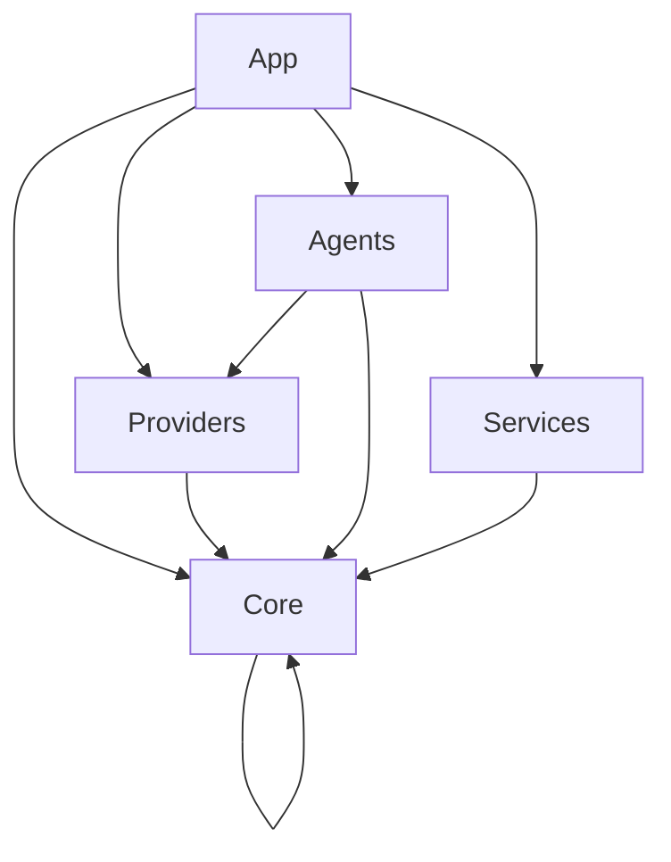

# ADR-004: Solution and Project Structure

**Status**: Accepted
**Date**: 2026-02-23 (Updated 2026-02-23)
**Author**: Development Team

---

## Context

We need a sustainable project structure that supports:

1. **Multiple Agents**: SceneParser, SceneVerifier, PhotoPromptCreator, etc.
2. **Multiple AI Providers**: Ollama (current), OpenAI/Anthropic (future)
3. **Testing**: Clear boundaries for unit/integration tests
4. **Team Collaboration**: Clearer ownership and reduced merge conflicts
5. **Build Performance**: Incremental builds for unchanged projects
6. **Clean Architecture**: Separation of concerns with clear dependencies

## Decision

**Adopt a hybrid Clean Architecture + Vertical Slice structure with multiple projects.**

### Project Structure

```
AIScriptToMediaDotNet/
├── src/
│   ├── AIScriptToMediaDotNet.Core/        # Shared kernel (interfaces, options)
│   ├── AIScriptToMediaDotNet.Providers/   # AI provider implementations
│   ├── AIScriptToMediaDotNet.Agents/      # Agent implementations (vertical slices)
│   ├── AIScriptToMediaDotNet.Services/    # External services (ComfyUI, Export)
│   └── AIScriptToMediaDotNet.App/         # Composition root (EXE)
│
├── tests/
│   ├── AIScriptToMediaDotNet.Core.Tests/
│   ├── AIScriptToMediaDotNet.Providers.Tests/
│   ├── AIScriptToMediaDotNet.Agents.Tests/
│   └── AIScriptToMediaDotNet.Integration.Tests/
│
└── docs/
```

### Project Dependencies



### Responsibility Matrix

| Project | Responsibility | Examples |
|---------|---------------|----------|
| **Core** | Shared abstractions, interfaces, options | `IAIProvider`, `ModelOptions`, `OllamaOptions` |
| **Providers** | AI provider implementations | `OllamaProvider`, future `OpenAIProvider` |
| **Agents** | Agent business logic | `SceneParserAgent`, `PhotoPromptCreatorAgent` |
| **Services** | External service clients | `ComfyUIClient`, `ExportService` |
| **App** | Composition, configuration, entry point | `Program.cs`, `appsettings.json` |

---

## Consequences

### Positive

- **Clear architectural boundaries**: Each project has a single responsibility
- **Independent testability**: Test projects can target specific layers
- **Reusable components**: Providers, Agents, Services can be reused in other apps
- **Parallel development**: Team members can work on different projects
- **Incremental builds**: Only changed projects need recompilation
- **Dependency enforcement**: Project references prevent circular dependencies

### Negative

- **More complex solution navigation**: More projects in Solution Explorer
- **Cross-project reference management**: Need to manage NuGet packages per project
- **Multiple deployment artifacts**: Each project produces its own DLL
- **Initial setup overhead**: More boilerplate for new projects

### Trade-offs

| Factor | Single Project | Multi-Project (chosen) |
|--------|---------------|------------------------|
| Simplicity | ✅ Simple | ❌ More complex |
| Testability | ❌ Harder to isolate | ✅ Easy to mock |
| Reusability | ❌ All-or-nothing | ✅ Pick and choose |
| Build time | ❌ Full rebuild | ✅ Incremental |
| Team collaboration | ❌ Merge conflicts | ✅ Clear ownership |

---

## Implementation

### Completed Steps

1. Created solution with 9 projects (5 src, 4 tests)
2. Migrated existing code to new structure:
   - `Core`: Interfaces, Options
   - `Providers`: OllamaProvider, extension methods
   - `App`: Program.cs, appsettings.json
3. Configured project references and NuGet packages
4. Verified build succeeds with 0 warnings, 0 errors

### Namespace Conventions

| Project | Root Namespace | Example |
|---------|---------------|---------|
| Core | `AIScriptToMediaDotNet.Core` | `AIScriptToMediaDotNet.Core.Interfaces.IAIProvider` |
| Providers | `AIScriptToMediaDotNet.Providers` | `AIScriptToMediaDotNet.Providers.Ollama.OllamaProvider` |
| Agents | `AIScriptToMediaDotNet.Agents` | `AIScriptToMediaDotNet.Agents.Scene.SceneParserAgent` |
| Services | `AIScriptToMediaDotNet.Services` | `AIScriptToMediaDotNet.Services.ComfyUI.ComfyUIClient` |
| App | `AIScriptToMediaDotNet.App` | `AIScriptToMediaDotNet.App.Program` |

---

## Action Items

- [x] Create multi-project solution structure
- [x] Migrate existing code to new projects
- [x] Configure project references and NuGet packages
- [x] Update ADR with decision
- [ ] Add agents to `AIScriptToMediaDotNet.Agents` project
- [ ] Add ComfyUI client to `AIScriptToMediaDotNet.Services` project
- [ ] Write unit tests for each layer
- [ ] Add integration tests for full pipeline
