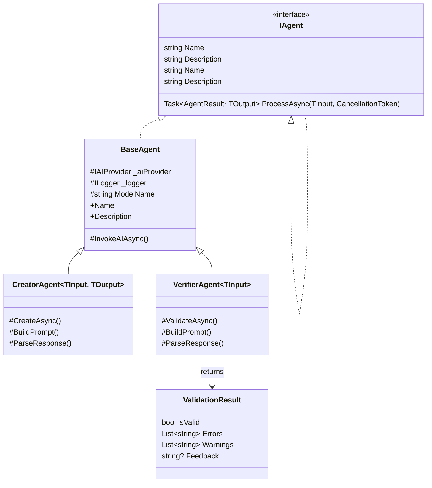

# ADR-005: Agent Interface Design

**Status**: Accepted
**Date**: 2026-02-23
**Author**: Development Team

---

## Context

We need a consistent interface for all agents in the pipeline. Requirements:

1. **Uniform contract**: All agents should have consistent input/output
2. **Generic support**: Different agents process different data types
3. **Error handling**: Standardized error reporting
4. **Validation support**: Verifier agents need different contract than creators
5. **Async execution**: All agents run asynchronously
6. **Testability**: Easy to mock for unit tests
7. **Dependency Injection**: Agents should be registrable in DI container

## Decision

We will use a **generic interface pattern** with specialized base classes.

### Interface Hierarchy



### Core Interface

```csharp
public interface IAgent
{
    string Name { get; }
    string Description { get; }
}

public interface IAgent<in TInput, TOutput> : IAgent
{
    Task<AgentResult<TOutput>> ProcessAsync(TInput input, CancellationToken ct = default);
}
```

### Result Types

```csharp
public class AgentResult
{
    public bool Success { get; set; }
    public List<string> Errors { get; set; } = new();
    public List<string> Warnings { get; set; } = new();
    public TimeSpan ExecutionTime { get; set; }
    public Dictionary<string, object?> Metadata { get; set; } = new();

    public static AgentResult Ok() => new() { Success = true };
    public static AgentResult Fail(string error) => new() { Success = false, Errors = { error } };
}

public class AgentResult<T> : AgentResult
{
    public T? Data { get; set; }

    public static AgentResult<T> Ok(T data) => new() { Success = true, Data = data };
    public static AgentResult<T> Fail(string error) => new() { Success = false, Errors = { error } };
}
```

### Validation Result (for Verifier Agents)

```csharp
public class ValidationResult
{
    public bool IsValid { get; set; }
    public List<string> Errors { get; set; } = new();
    public List<string> Warnings { get; set; } = new();
    public string? Feedback { get; set; } // Instructions for correction

    public static ValidationResult Pass() => new() { IsValid = true };
    public static ValidationResult Fail(string error, string? feedback = null)
        => new() { IsValid = false, Errors = { error }, Feedback = feedback };
}
```

### Base Classes

```csharp
public abstract class BaseAgent : IAgent
{
    public abstract string Name { get; }
    public virtual string Description => $"Agent that processes {GetType().Name}";

    protected readonly IAIProvider AIProvider;
    protected readonly string ModelName;

    protected BaseAgent(IAIProvider aiProvider, ILogger<BaseAgent> logger)
    {
        AIProvider = aiProvider;
        _logger = logger;
        ModelName = aiProvider.GetModelForAgent(GetType().Name);
    }

    protected Task<string> InvokeAIAsync(string prompt, CancellationToken ct)
    {
        // Common AI invocation logic with logging
    }
}

public abstract class CreatorAgent<TInput, TOutput> : BaseAgent, IAgent<TInput, TOutput>
{
    protected CreatorAgent(IAIProvider aiProvider, ILogger<CreatorAgent<TInput, TOutput>> logger)
        : base(aiProvider, logger) { }

    public abstract Task<AgentResult<TOutput>> ProcessAsync(TInput input, CancellationToken ct);

    protected abstract Task<TOutput> CreateAsync(TInput input, CancellationToken ct);
    protected abstract string BuildPrompt(TInput input);
    protected abstract TOutput ParseResponse(string response);
}

public abstract class VerifierAgent<TInput> : BaseAgent, IAgent<TInput, ValidationResult>
{
    protected VerifierAgent(IAIProvider aiProvider, ILogger<VerifierAgent<TInput>> logger)
        : base(aiProvider, logger) { }

    public abstract Task<AgentResult<ValidationResult>> ProcessAsync(TInput input, CancellationToken ct);

    protected abstract Task<ValidationResult> ValidateAsync(TInput input, CancellationToken ct);
    protected abstract string BuildPrompt(TInput input);
    protected abstract ValidationResult ParseResponse(string response);
}
```

### DI Registration

```csharp
public static class AgentServiceCollectionExtensions
{
    public static IServiceCollection AddAgent<TAgent>(this IServiceCollection services)
        where TAgent : BaseAgent
    {
        services.AddScoped<TAgent>();
        return services;
    }

    public static IServiceCollection AddAgents<TAgent1, TAgent2>(this IServiceCollection services)
        where TAgent1 : BaseAgent
        where TAgent2 : BaseAgent
    {
        services.AddScoped<TAgent1>();
        services.AddScoped<TAgent2>();
        return services;
    }
}
```

### Example: Future Scene Parser Agent

```csharp
public class SceneParserAgent : CreatorAgent<string, List<Scene>>
{
    public override string Name => "SceneParser";
    public override string Description => "Parses script text into discrete scenes";

    public SceneParserAgent(IAIProvider aiProvider, ILogger<SceneParserAgent> logger)
        : base(aiProvider, logger) { }

    protected override string BuildPrompt(string script)
    {
        return $"""
        Parse the following script into discrete scenes.
        Return JSON array with: id, title, description, location, characters, time.

        Script:
        {script}
        """;
    }

    protected override async Task<List<Scene>> CreateAsync(string script, CancellationToken ct)
    {
        var prompt = BuildPrompt(script);
        var response = await InvokeAIAsync(prompt, ct);
        return ParseResponse(response);
    }

    protected override List<Scene> ParseResponse(string response)
    {
        // Parse JSON response into List<Scene>
    }

    public override async Task<AgentResult<List<Scene>>> ProcessAsync(string script, CancellationToken ct)
    {
        var stopwatch = Stopwatch.StartNew();
        try
        {
            var scenes = await CreateAsync(script, ct);
            stopwatch.Stop();
            return CreateSuccessResult(scenes, stopwatch.Elapsed);
        }
        catch (Exception ex)
        {
            stopwatch.Stop();
            _logger.LogError(ex, "Scene parsing failed");
            return CreateFailureResult<List<Scene>>($"Parsing failed: {ex.Message}", stopwatch.Elapsed);
        }
    }
}
```

### Example: Future Scene Verifier Agent

```csharp
public class SceneVerifierAgent : VerifierAgent<List<Scene>>
{
    public override string Name => "SceneVerifier";
    public override string Description => "Validates parsed scenes against original script";

    public SceneVerifierAgent(IAIProvider aiProvider, ILogger<SceneVerifierAgent> logger)
        : base(aiProvider, logger) { }

    protected override string BuildPrompt((string Script, List<Scene> Scenes) input)
    {
        return $"""
        Validate these parsed scenes against the original script.
        Check: scene count合理性，descriptions match script, no missing content.
        
        Script: {input.Script}
        
        Scenes: {JsonSerializer.Serialize(input.Scenes)}
        
        Return JSON: {{ isValid: bool, errors: string[], feedback: string }}
        """;
    }

    protected override async Task<ValidationResult> ValidateAsync(List<Scene> scenes, CancellationToken ct)
    {
        // Access to original script would come from context
        var prompt = BuildPrompt((/* script */, scenes));
        var response = await InvokeAIAsync(prompt, ct);
        return ParseResponse(response);
    }

    protected override ValidationResult ParseResponse(string response)
    {
        // Parse JSON response into ValidationResult
    }

    public override async Task<AgentResult<ValidationResult>> ProcessAsync(List<Scene> scenes, CancellationToken ct)
    {
        var validationResult = await ValidateAsync(scenes, ct);

        return validationResult.IsValid
            ? CreateSuccessResult(validationResult)
            : CreateFailureResult<ValidationResult>(
                string.Join("; ", validationResult.Errors));
    }
}
```

## Consequences

### Positive

- **Consistency**: All agents follow same pattern
- **Type safety**: Generics provide compile-time checking
- **Testability**: Interfaces easy to mock
- **Reusability**: Base classes reduce boilerplate
- **Extensibility**: Easy to add new agent types
- **Clear contracts**: Input/output types explicit
- **DI Integration**: Simple registration pattern
- **Model Selection**: Each agent gets configured model automatically

### Negative

- **Complexity**: More types/interfaces than simple functions
- **Boilerplate**: Base classes add some overhead
- **Learning curve**: New developers must understand pattern

### Trade-offs

| Approach | Pros | Cons |
|----------|------|------|
| **Generic Interface** (chosen) | Type-safe, testable, consistent | More types, some boilerplate |
| **Simple Functions** | Less code, simpler | Harder to test, no consistency |
| **Delegate-based** | Flexible, lightweight | Less discoverable, harder to document |

---

## Retry Integration

Orchestrator (CORE-005) will handle retries, agents don't need retry logic:

```csharp
public class Orchestrator
{
    private const int MaxRetries = 3;

    public async Task<AgentResult<T>> ExecuteWithRetryAsync<T>(
        IAgent<object, T> agent,
        object input,
        CancellationToken ct)
    {
        for (int i = 0; i < MaxRetries; i++)
        {
            var result = await agent.ProcessAsync(input, ct);

            if (result.Success)
                return result;

            _logger.LogWarning("Retry {RetryCount} for agent {AgentName}", i + 1, agent.Name);
        }

        return AgentResult<T>.Fail($"Max retries ({MaxRetries}) exceeded for {agent.Name}");
    }
}
```

---

## References

- [ADR-003](ADR-003-agent-interface.md) - Original agent interface design (superseded)
- .NET Generic Interfaces: https://learn.microsoft.com/dotnet/csharp/programming-guide/generics/
- Async Best Practices: https://learn.microsoft.com/dotnet/csharp/async

---

## Related Issues

- Closes #3 (CORE-003)
