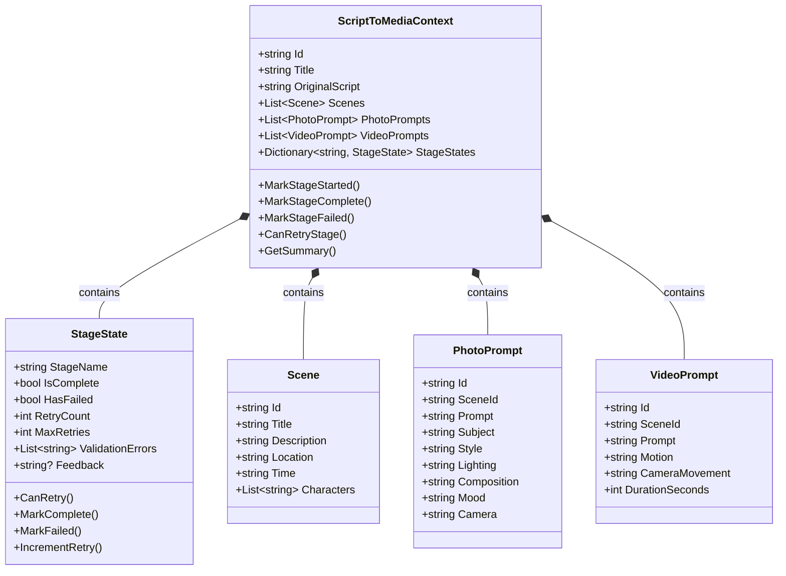

# ADR-006: Shared Context Object Design

**Status**: Accepted
**Date**: 2026-02-23
**Author**: Development Team

---

## Context

We need a shared context object for the multi-agent pipeline. Requirements:

1. **State sharing**: All agents need access to shared data (script, scenes, prompts)
2. **Progress tracking**: Track completion status per pipeline stage
3. **Retry tracking**: Track retry counts and validation errors per stage
4. **Serialization**: Support debugging/logging via JSON serialization
5. **Thread safety**: Support potential concurrent agent execution
6. **Extensibility**: Easy to add new data types as pipeline evolves

## Decision

We will use a **centralized context object** (`ScriptToMediaContext`) with embedded stage state tracking.

### Context Structure



### Core Context Class

```csharp
public class ScriptToMediaContext
{
    public string Id { get; set; } = Guid.NewGuid().ToString("N")[..8];
    public string Title { get; set; } = string.Empty;
    public string OriginalScript { get; set; } = string.Empty;
    
    public List<Scene> Scenes { get; set; } = new();
    public List<PhotoPrompt> PhotoPrompts { get; set; } = new();
    public List<VideoPrompt> VideoPrompts { get; set; } = new();
    
    public IReadOnlyDictionary<string, StageState> StageStates => _stageStates.AsReadOnly();
    
    // Stage state management
    public StageState GetOrCreateStageState(string stageName) { }
    public void MarkStageStarted(string stageName) { }
    public void MarkStageComplete(string stageName, TimeSpan? executionTime = null) { }
    public void MarkStageFailed(string stageName, IEnumerable<string> errors, string? feedback = null) { }
    public void IncrementStageRetry(string stageName) { }
    public bool CanRetryStage(string stageName) { }
    public string? GetStageFeedback(string stageName) { }
    
    // Pipeline status
    public bool IsComplete => _stageStates.Values.All(s => s.IsComplete);
    public bool HasFailed => _stageStates.Values.Any(s => s.HasFailed && !s.CanRetry());
    public string CurrentStage => _stageStates.Values.FirstOrDefault(s => !s.IsComplete)?.StageName ?? "Completed";
    
    public string GetSummary() { } // For logging
}
```

### Stage State Tracking

```csharp
public class StageState
{
    public string StageName { get; set; } = string.Empty;
    public bool IsComplete { get; set; }
    public bool HasFailed { get; set; }
    public int RetryCount { get; set; }
    public int MaxRetries { get; set; } = 3;
    
    public List<string> ValidationErrors { get; set; } = new();
    public List<string> Warnings { get; set; } = new();
    public string? Feedback { get; set; } // From verifier to creator
    
    public DateTime? StartedAt { get; set; }
    public DateTime? CompletedAt { get; set; }
    public TimeSpan? ExecutionTime { get; set; }
    
    public bool CanRetry() => RetryCount < MaxRetries;
    public void ResetForRetry() { }
    public void MarkComplete(TimeSpan? executionTime = null) { }
    public void MarkFailed(IEnumerable<string> errors, string? feedback = null) { }
    public void IncrementRetry() { }
}
```

### Domain Models

#### Scene
```csharp
public class Scene
{
    public string Id { get; set; } = string.Empty;        // "SCENE-001"
    public string Title { get; set; } = string.Empty;      // Slug line
    public string Description { get; set; } = string.Empty; // Action/mood
    public string Location { get; set; } = string.Empty;   // INT./EXT.
    public string Time { get; set; } = string.Empty;       // DAY/NIGHT
    public List<string> Characters { get; set; } = new();  // Character names
}
```

#### PhotoPrompt
```csharp
public class PhotoPrompt
{
    public string Id { get; set; } = string.Empty;
    public string SceneId { get; set; } = string.Empty;
    public string Prompt { get; set; } = string.Empty;      // Full prompt
    public string Subject { get; set; } = string.Empty;
    public string Style { get; set; } = string.Empty;
    public string Lighting { get; set; } = string.Empty;
    public string Composition { get; set; } = string.Empty;
    public string Mood { get; set; } = string.Empty;
    public string Camera { get; set; } = string.Empty;
    public string? ScriptExcerpt { get; set; }
    public string? NegativePrompt { get; set; }
}
```

#### VideoPrompt
```csharp
public class VideoPrompt
{
    public string Id { get; set; } = string.Empty;
    public string SceneId { get; set; } = string.Empty;
    public string Prompt { get; set; } = string.Empty;
    public string Motion { get; set; } = string.Empty;
    public string CameraMovement { get; set; } = string.Empty;
    public int DurationSeconds { get; set; }
    public string? Transition { get; set; }
    public string? ScriptExcerpt { get; set; }
}
```

### Usage Example

```csharp
// In Orchestrator
public class Orchestrator
{
    private readonly ScriptToMediaContext _context;
    
    public async Task ExecutePipelineAsync()
    {
        // Scene Parsing Stage
        _context.MarkStageStarted("SceneParsing");
        var parserResult = await _sceneParser.ProcessAsync(_context.OriginalScript);
        
        if (parserResult.Success)
        {
            _context.Scenes = parserResult.Data;
            _context.MarkStageComplete("SceneParsing", parserResult.ExecutionTime);
        }
        else
        {
            _context.MarkStageFailed("SceneParsing", parserResult.Errors);
            
            // Retry logic
            if (_context.CanRetryStage("SceneParsing"))
            {
                _context.IncrementStageRetry("SceneParsing");
                var feedback = _context.GetStageFeedback("SceneParsing");
                // Retry with feedback...
            }
        }
        
        // Continue to next stage...
    }
}

// In Agent
public class SceneParserAgent : CreatorAgent<string, List<Scene>>
{
    public override async Task<AgentResult<List<Scene>>> ProcessAsync(
        string script, 
        CancellationToken ct)
    {
        var stopwatch = Stopwatch.StartNew();
        try
        {
            var prompt = BuildPrompt(script);
            var response = await InvokeAIAsync(prompt, ct);
            var scenes = ParseResponse(response);
            
            stopwatch.Stop();
            return CreateSuccessResult(scenes, stopwatch.Elapsed);
        }
        catch (Exception ex)
        {
            stopwatch.Stop();
            return CreateFailureResult<List<Scene>>($"Parsing failed: {ex.Message}", stopwatch.Elapsed);
        }
    }
}
```

### Serialization for Logging

```csharp
// Serialize context for agent-log.md
var options = new JsonSerializerOptions
{
    WriteIndented = true,
    DefaultIgnoreCondition = JsonIgnoreCondition.WhenWritingNull
};

var json = JsonSerializer.Serialize(context, options);

// Log context summary
_logger.LogInformation(context.GetSummary());
```

## Consequences

### Positive

- **Centralized state**: Single source of truth for pipeline data
- **Progress visibility**: Easy to track which stage is active/complete/failed
- **Retry support**: Built-in retry tracking per stage
- **Debugging**: Serializable for logging and inspection
- **Extensibility**: Easy to add new prompt types or stages
- **Feedback loop**: Verifier feedback stored in context for creator retry

### Negative

- **Large object**: Context grows as pipeline progresses
- **Coupling**: Agents depend on context structure
- **Memory**: All data held in memory during pipeline execution

### Trade-offs

| Factor | Alternative | Chosen Approach |
|--------|-------------|-----------------|
| State management | Pass individual parameters | Centralized context |
| Stage tracking | Separate tracker class | Embedded in context |
| Serialization | Custom logger | JSON-serializable context |

---

## Pipeline Stages

| Stage | Input | Output | Verifier |
|-------|-------|--------|----------|
| SceneParsing | OriginalScript | Scenes | SceneVerifier |
| SceneVerification | Scenes | ValidationResult | - |
| PhotoPromptCreation | Scenes | PhotoPrompts | PhotoPromptVerifier |
| PhotoPromptVerification | PhotoPrompts | ValidationResult | - |
| VideoPromptCreation | Scenes | VideoPrompts | VideoPromptVerifier |
| VideoPromptVerification | VideoPrompts | ValidationResult | - |
| Export | All data | Markdown files | - |
| ImageGeneration | PhotoPrompts | Images | - |

---

## Related Issues

- Closes #4 (CORE-004)
- Enables: CORE-005 (Orchestrator), SCENE-001/002, PHOTO-001/002, VIDEO-001/002

---

## References

- [ADR-005](ADR-005-agent-interface.md) - Agent Interface Design
- [ADR-004](ADR-004-solution-structure.md) - Solution Structure
