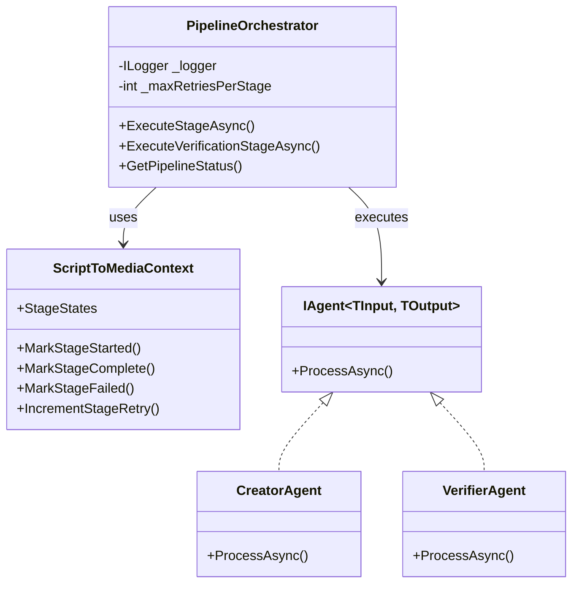
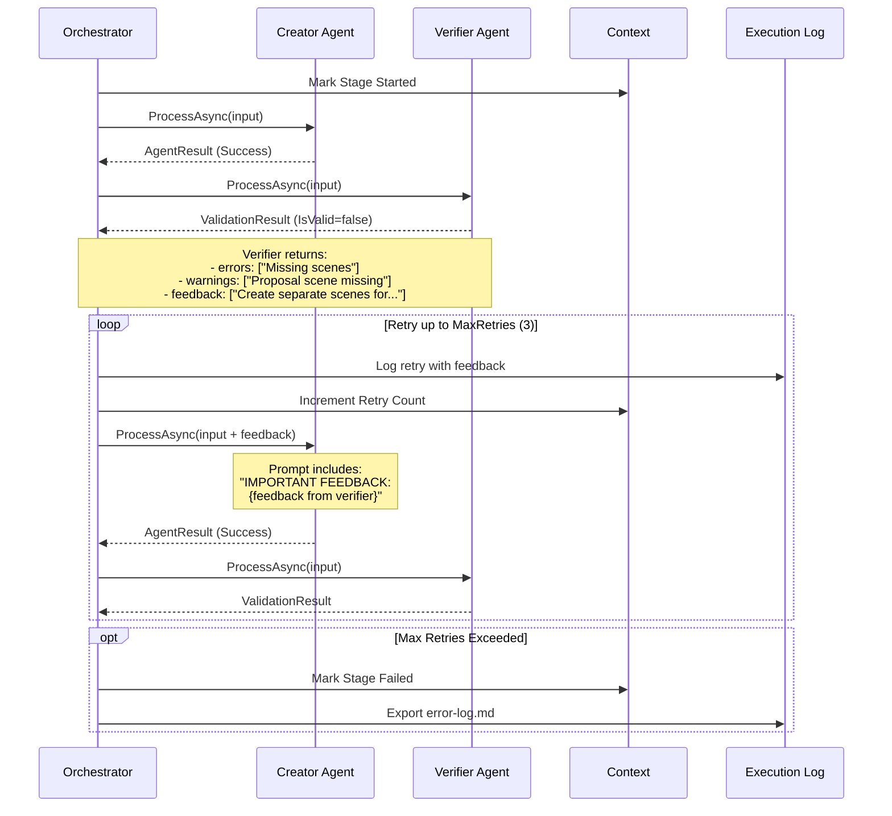

# ADR-007: Orchestrator Implementation

**Status**: Accepted
**Date**: 2026-02-23
**Author**: Development Team

---

## Context

We need a central orchestrator to manage the multi-agent pipeline execution. Requirements:

1. **Sequential execution**: Agents must execute in correct order
2. **Retry logic**: Up to 3 retry attempts per verification stage
3. **Error handling**: Graceful failure with detailed error reporting
4. **Progress tracking**: Real-time status updates
5. **Logging**: Detailed execution logs for debugging
6. **Cancellation support**: Ability to cancel long-running pipelines

## Decision

We will use a **PipelineOrchestrator** class that manages stage execution with built-in retry logic.

### Orchestrator Architecture



### Core Orchestrator Class

```csharp
public class PipelineOrchestrator
{
    private readonly ILogger<PipelineOrchestrator> _logger;
    private readonly int _maxRetriesPerStage = 3;

    public PipelineOrchestrator(ILogger<PipelineOrchestrator> logger, int maxRetriesPerStage = 3)
    {
        _logger = logger;
        _maxRetriesPerStage = maxRetriesPerStage;
    }

    /// <summary>
    /// Executes a single pipeline stage with retry logic.
    /// </summary>
    public async Task<bool> ExecuteStageAsync<TInput, TOutput>(
        ScriptToMediaContext context,
        string stageName,
        IAgent<TInput, TOutput> agent,
        Func<ScriptToMediaContext, TInput> inputProvider,
        Action<ScriptToMediaContext, TOutput> outputConsumer,
        CancellationToken cancellationToken = default)
    {
        _logger.LogInformation("Starting stage: {StageName} (Agent: {AgentName})", stageName, agent.Name);
        context.MarkStageStarted(stageName);

        var attempt = 0;
        string? feedback = null;

        while (attempt < _maxRetriesPerStage)
        {
            attempt++;
            context.IncrementStageRetry(stageName);

            try
            {
                var input = inputProvider(context);
                var result = await agent.ProcessAsync(input, cancellationToken);

                if (result.Success)
                {
                    outputConsumer(context, result.Data!);
                    context.MarkStageComplete(stageName, result.ExecutionTime);
                    return true;
                }

                // Failed - store feedback for retry
                feedback = result.Metadata.TryGetValue("Feedback", out var fb) ? fb?.ToString() : null;
                context.MarkStageFailed(stageName, result.Errors, feedback);
            }
            catch (Exception ex)
            {
                context.MarkStageFailed(stageName, new[] { ex.Message }, null);
            }

            if (attempt >= _maxRetriesPerStage)
                break;

            await Task.Delay(1000 * attempt, cancellationToken); // Exponential backoff
        }

        return false; // All retries exhausted
    }

    /// <summary>
    /// Executes a verification stage with retry logic.
    /// </summary>
    public async Task<ValidationResult> ExecuteVerificationStageAsync<TInput>(
        ScriptToMediaContext context,
        string stageName,
        IAgent<TInput, ValidationResult> verifierAgent,
        Func<ScriptToMediaContext, TInput> inputProvider,
        CancellationToken cancellationToken = default)
    {
        // Similar retry logic, returns ValidationResult
    }

    /// <summary>
    /// Gets the current pipeline status.
    /// </summary>
    public string GetPipelineStatus(ScriptToMediaContext context)
    {
        // Returns formatted status string
    }
}
```

### Retry Sequence with Feedback



### Feedback Mechanism

**All verifier agents MUST return feedback when validation fails.** This feedback is:

1. **Captured by PipelineOrchestrator** from `ValidationResult.Feedback` property
2. **Passed to creator agent** on retry via input object (e.g., `SceneParserInput.Feedback`)
3. **Appended to AI prompt** as: "IMPORTANT FEEDBACK FROM PREVIOUS REVIEW: {feedback}"
4. **Used by creator** to revise output and address specific issues

**Warnings as Errors:** If a verifier returns warnings indicating missing content (keywords: "missing", "incomplete", "not fully captured", "should be created", "split", "separate scenes"), the orchestrator treats these as validation failures and triggers retry, even if `IsValid=true`.

**Example Feedback Flow:**

```csharp
// Verifier returns
new ValidationResult {
    IsValid = false,
    Errors = ["Only 1 scene for multi-beat script"],
    Warnings = ["Proposal scene missing"],
    Feedback = "Create separate scenes for: 1) Workout, 2) Proposal planning, 3) Acceptance"
}

// Creator receives on retry
new SceneParserInput {
    Script = "FADE IN: ...",
    Feedback = "Create separate scenes for: 1) Workout, 2) Proposal planning, 3) Acceptance"
}

// Creator's prompt becomes
"You are a professional script analyzer...

SCRIPT TO ANALYZE:
FADE IN: ...

IMPORTANT FEEDBACK FROM PREVIOUS REVIEW:
Create separate scenes for: 1) Workout, 2) Proposal planning, 3) Acceptance

Please revise your scene parsing to address this feedback."
```

### Usage Example

```csharp
public class ScriptToMediaService
{
    private readonly PipelineOrchestrator _orchestrator;
    private readonly SceneParserAgent _sceneParser;
    private readonly SceneVerifierAgent _sceneVerifier;
    // ... other agents

    public async Task<ScriptToMediaContext> ProcessScriptAsync(
        string title,
        string script,
        CancellationToken ct = default)
    {
        // Initialize context
        var context = new ScriptToMediaContext
        {
            Title = title,
            OriginalScript = script,
            MaxRetriesPerStage = 3
        };

        // Stage 1: Scene Parsing
        var parsed = await _orchestrator.ExecuteStageAsync(
            context,
            "SceneParsing",
            _sceneParser,
            ctx => ctx.OriginalScript,
            (ctx, scenes) => ctx.Scenes = scenes,
            ct);

        if (!parsed)
        {
            _logger.LogError("Scene parsing failed after all retries");
            return context; // Return with error state
        }

        // Stage 2: Scene Verification
        var verification = await _orchestrator.ExecuteVerificationStageAsync(
            context,
            "SceneVerification",
            _sceneVerifier,
            ctx => ctx.Scenes,
            ct);

        if (!verification.IsValid)
        {
            _logger.LogError("Scene verification failed");
            return context;
        }

        // Continue with photo prompts, video prompts, etc.
        // ...

        return context;
    }
}
```

### Pipeline Stages

| # | Stage | Agent Type | Input | Output | Retries |
|---|-------|------------|-------|--------|---------|
| 1 | SceneParsing | Creator | OriginalScript | Scenes | 3 |
| 2 | SceneVerification | Verifier | Scenes | ValidationResult | 3 |
| 3 | PhotoPromptCreation | Creator | Scenes + Script | PhotoPrompts | 3 |
| 4 | PhotoPromptVerification | Verifier | PhotoPrompts | ValidationResult | 3 |
| 5 | VideoPromptCreation | Creator | Scenes + Script | VideoPrompts | 3 |
| 6 | VideoPromptVerification | Verifier | VideoPrompts | ValidationResult | 3 |
| 7 | Export | Service | All data | Markdown files | 1 |
| 8 | ImageGeneration | Service | PhotoPrompts | Images | 3 |

### Error Handling Strategy

```csharp
try
{
    var result = await agent.ProcessAsync(input, cancellationToken);

    if (result.Success)
    {
        // Success path
    }
    else
    {
        // Handle agent failure
        context.MarkStageFailed(stageName, result.Errors, feedback);
        _logger.LogWarning("Stage failed: {Errors}", result.Errors);
    }
}
catch (OperationCanceledException) when (cancellationToken.IsCancellationRequested)
{
    // Graceful cancellation
    _logger.LogInformation("Stage cancelled by user");
    throw;
}
catch (Exception ex)
{
    // Unexpected exception
    context.MarkStageFailed(stageName, new[] { ex.Message }, null);
    _logger.LogError(ex, "Stage threw exception");
}
```

### Progress Reporting

```csharp
public string GetPipelineStatus(ScriptToMediaContext context)
{
    var status = new StringBuilder();
    status.AppendLine($"Pipeline: {context.Title} (ID: {context.Id})");
    status.AppendLine($"Current Stage: {context.CurrentStage}");
    status.AppendLine($"Total Retries: {context.TotalRetryCount}");
    status.AppendLine();
    status.AppendLine("Stage Progress:");

    foreach (var stageState in context.StageStates)
    {
        var state = stageState.Value;
        var icon = state.IsComplete ? "✓" : state.HasFailed ? "✗" : "→";
        status.AppendLine($"  {icon} {state.StageName}: Retries={state.RetryCount}");
    }

    return status.ToString();
}
```

## Consequences

### Positive

- **Centralized control**: Single point of pipeline management
- **Consistent retry logic**: All stages use same retry pattern
- **Progress visibility**: Real-time status tracking
- **Error isolation**: Failures contained to individual stages
- **Logging**: Detailed execution logs for debugging
- **Cancellation**: Long-running pipelines can be cancelled

### Negative

- **Complexity**: Orchestrator adds another layer
- **Coupling**: Orchestrator knows about all stages
- **Error propagation**: Must carefully handle exceptions

### Trade-offs

| Factor | Alternative | Chosen Approach |
|--------|-------------|-----------------|
| Control flow | Each agent calls next | Central orchestrator |
| Retry logic | Per-agent retry | Orchestrator-managed |
| Error handling | Throw exceptions | Return results + context tracking |

---

## Related Issues

- Closes #5 (CORE-005)
- Depends on: CORE-003 (Agent Interface), CORE-004 (Shared Context)
- Enables: SCENE-001/002, PHOTO-001/002, VIDEO-001/002

---

## References

- [ADR-005](ADR-005-agent-interface.md) - Agent Interface Design
- [ADR-006](ADR-006-shared-context.md) - Shared Context Object Design
