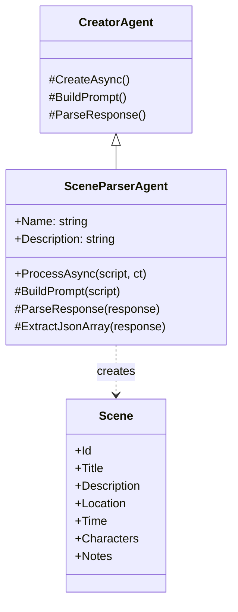

# ADR-008: Scene Parser Agent Implementation

**Status**: Accepted
**Date**: 2026-02-23
**Author**: Development Team

---

## Context

We need an agent to parse script text into structured scene data. This is the first agent in the pipeline and provides the foundation for all downstream processing.

Requirements:
1. **Intelligent parsing**: Use AI to understand script structure
2. **Structured output**: Return scenes as JSON objects
3. **Complete scene data**: Extract all required fields (id, title, description, location, time, characters)
4. **Error handling**: Graceful failure with meaningful error messages
5. **Retry support**: Work with orchestrator retry loop

## Decision

We will implement `SceneParserAgent` as a `CreatorAgent<string, List<Scene>>` that uses AI to intelligently parse scripts.

### Agent Architecture



### SceneParserAgent Implementation

```csharp
public class SceneParserAgent : CreatorAgent<string, List<Scene>>
{
    public override string Name => "SceneParser";
    public override string Description => "Parses script text into discrete scenes";

    public SceneParserAgent(IAIProvider aiProvider, ILogger<SceneParserAgent> logger)
        : base(aiProvider, logger)
    {
    }

    public override async Task<AgentResult<List<Scene>>> ProcessAsync(
        string script, 
        CancellationToken ct)
    {
        var stopwatch = Stopwatch.StartNew();
        try
        {
            var prompt = BuildPrompt(script);
            var response = await InvokeAIAsync(prompt, ct);
            var scenes = ParseResponse(response);
            stopwatch.Stop();
            return CreateSuccessResult(scenes, stopwatch.Elapsed);
        }
        catch (JsonException ex)
        {
            stopwatch.Stop();
            return CreateFailureResult<List<Scene>>($"JSON parsing failed: {ex.Message}", stopwatch.Elapsed);
        }
        catch (Exception ex)
        {
            stopwatch.Stop();
            return CreateFailureResult<List<Scene>>($"Parsing failed: {ex.Message}", stopwatch.Elapsed);
        }
    }

    protected override string BuildPrompt(string script)
    {
        // Detailed prompt with JSON schema
        return $"""
            You are a professional script analyzer...
            
            SCRIPT TO ANALYZE:
            {script}
            
            Respond with ONLY a JSON array...
            """;
    }

    protected override List<Scene> ParseResponse(string response)
    {
        var json = ExtractJsonArray(response);
        return JsonSerializer.Deserialize<List<Scene>>(json)
            ?? throw new JsonException("Failed to deserialize");
    }

    private static string ExtractJsonArray(string response)
    {
        // Extract JSON array from response text
        var startIndex = response.IndexOf('[');
        var endIndex = response.LastIndexOf(']');
        return response.Substring(startIndex, endIndex - startIndex + 1);
    }
}
```

### Scene Model

```csharp
public class Scene
{
    public string Id { get; set; } = string.Empty;        // "SCENE-001"
    public string Title { get; set; } = string.Empty;      // "INT. COFFEE SHOP - DAY"
    public string Description { get; set; } = string.Empty; // Action description
    public string Location { get; set; } = string.Empty;   // "Coffee Shop"
    public string Time { get; set; } = string.Empty;       // "DAY", "NIGHT"
    public List<string> Characters { get; set; } = new();  // ["JOHN", "MARY"]
    public string? Notes { get; set; }                     // Optional notes
}
```

### Prompt Design

The prompt includes:
1. **Role definition**: "You are a professional script analyzer"
2. **Task description**: Clear explanation of what to do
3. **Field definitions**: What each field means
4. **Input script**: The actual script to parse
5. **Output format**: Exact JSON schema with example
6. **Constraints**: "Respond with ONLY a JSON array"

### JSON Extraction Strategy

AI responses may include explanatory text. We extract the JSON array by:
1. Finding first `[` character
2. Finding last `]` character
3. Extracting substring between them

This handles cases where AI adds text before/after the JSON.

### Error Handling

| Error Type | Handling |
|------------|----------|
| JSON parse failure | Return `AgentResult.Fail()` with error message |
| Empty response | Throw `JsonException`, caught and returned as failure |
| Missing fields | Assign defaults (Id = "SCENE-001", Time = "DAY") |
| Network/AI error | Propagate to orchestrator for retry |

---

## Usage Example

```csharp
// Register in DI
services.AddAgent<SceneParserAgent>();

// Use with orchestrator
var orchestrator = new PipelineOrchestrator(logger);
var context = new ScriptToMediaContext
{
    Title = "My Script",
    OriginalScript = scriptText
};

var success = await orchestrator.ExecuteStageAsync(
    context,
    "SceneParsing",
    sceneParserAgent,
    ctx => ctx.OriginalScript,
    (ctx, scenes) => ctx.Scenes = scenes,
    cancellationToken);

if (success)
{
    Console.WriteLine($"Parsed {context.Scenes.Count} scenes");
}
```

---

## Consequences

### Positive

- **Intelligent parsing**: AI understands script structure better than regex
- **Flexible**: Handles various script formats
- **Structured output**: JSON easy to validate and process
- **Retry support**: Works with orchestrator retry loop
- **Logging**: Detailed logs for debugging

### Negative

- **AI dependency**: Quality depends on model capability
- **JSON fragility**: AI might return malformed JSON
- **Token usage**: Large scripts consume many tokens
- **Processing time**: AI parsing slower than regex

### Trade-offs

| Factor | Alternative | Chosen Approach |
|--------|-------------|-----------------|
| Parsing | Regex/rules | AI-based |
| Output format | Custom format | JSON |
| Error handling | Throw exceptions | Return AgentResult |

---

## Testing Strategy

### Unit Tests (Future)
```csharp
[Fact]
public async Task ProcessAsync_WithValidScript_ReturnsScenes()
{
    // Arrange
    var mockProvider = new Mock<IAIProvider>();
    mockProvider.Setup(x => x.GenerateResponseAsync(It.IsAny<string>(), It.IsAny<ModelOptions>()))
                .ReturnsAsync(MockJsonResponse);
    
    var agent = new SceneParserAgent(mockProvider.Object, NullLogger.Instance);
    var script = "FADE IN:\\n\\nINT. COFFEE SHOP - DAY\\n\\nJOHN enters...";
    
    // Act
    var result = await agent.ProcessAsync(script);
    
    // Assert
    Assert.True(result.Success);
    Assert.NotEmpty(result.Data);
    Assert.Equal("SCENE-001", result.Data[0].Id);
}
```

### Integration Tests (Future)
```csharp
[Fact]
public async Task FullPipeline_WithRealScript_ParsesScenes()
{
    // Test with real Ollama instance
}
```

---

## Related Issues

- Closes #6 (SCENE-001)
- Depends on: CORE-002 (AI Provider), CORE-003 (Agent Interface), CORE-004 (Context)
- Required by: SCENE-002 (Scene Verifier)

---

## References

- [ADR-005](ADR-005-agent-interface.md) - Agent Interface Design
- [ADR-006](ADR-006-shared-context.md) - Shared Context Object Design
- [ADR-007](ADR-007-orchestrator.md) - Orchestrator Implementation
