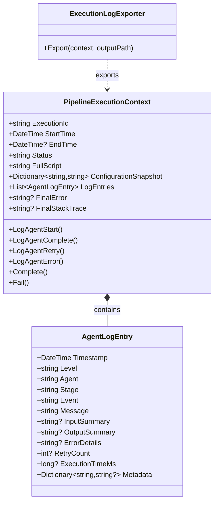

# ADR-009: Comprehensive Pipeline Logging

**Status**: Accepted
**Date**: 2026-02-23
**Author**: Development Team

---

## Context

We need comprehensive logging throughout the pipeline to:
1. Debug issues in production
2. Understand agent behavior and decision-making
3. Reproduce issues for troubleshooting
4. Monitor pipeline performance
5. Track retry attempts and validation feedback

Requirements:
- **Error logs**: Detailed with full stack traces, inputs, and context
- **Success logs**: Concise but informative with inputs and outputs
- **Execution timeline**: Chronological log of all events
- **Configuration snapshot**: Settings used for each run
- **Performance metrics**: Execution times per stage
- **Export format**: Human-readable markdown for easy review

## Decision

We will implement a structured logging system with:
1. `PipelineExecutionContext` - Captures full execution details
2. `AgentLogEntry` - Structured log entries for each event
3. `ExecutionLogExporter` - Exports detailed markdown logs
4. Error log export on failure for quick reference

### Architecture



### Implementation

#### PipelineExecutionContext

```csharp
public class PipelineExecutionContext
{
    public string ExecutionId { get; set; } = Guid.NewGuid().ToString("N")[..8];
    public DateTime StartTime { get; set; } = DateTime.UtcNow;
    public DateTime? EndTime { get; set; }
    public string Status { get; set; } = "Running";
    public string Title { get; set; } = string.Empty;
    public string FullScript { get; set; } = string.Empty;
    public string ScriptSummary { get; set; } = string.Empty;
    public Dictionary<string, string> ConfigurationSnapshot { get; set; } = new();
    public List<AgentLogEntry> LogEntries { get; set; } = new();
    public string? FinalError { get; set; }
    public string? FinalStackTrace { get; set; }
    
    public AgentLogEntry LogAgentStart(string agent, string stage, string inputSummary) { }
    public AgentLogEntry LogAgentComplete(string agent, string stage, string outputSummary, long executionTimeMs) { }
    public AgentLogEntry LogAgentRetry(string agent, string stage, int retryCount, string reason, string? feedback = null) { }
    public AgentLogEntry LogAgentError(string agent, string stage, string error, string? stackTrace, string? inputSummary = null) { }
    public void Complete(string status) { }
    public void Fail(string error, string? stackTrace = null) { }
}
```

#### AgentLogEntry

```csharp
public class AgentLogEntry
{
    public DateTime Timestamp { get; set; } = DateTime.UtcNow;
    public string Level { get; set; } = "INFO";
    public string Agent { get; set; } = string.Empty;
    public string Stage { get; set; } = string.Empty;
    public string Event { get; set; } = string.Empty;
    public string Message { get; set; } = string.Empty;
    public string? InputSummary { get; set; }
    public string? OutputSummary { get; set; }
    public string? ErrorDetails { get; set; }
    public int? RetryCount { get; set; }
    public long? ExecutionTimeMs { get; set; }
    public Dictionary<string, string?> Metadata { get; set; } = new();
}
```

### Log Levels

| Level | When Used |
|-------|-----------|
| INFO | Normal operation (start, complete) |
| WARN | Retry attempts, recoverable issues |
| ERROR | Failures, exceptions, validation errors |

### Event Types

| Event | Description |
|-------|-------------|
| Start | Agent/stage started execution |
| Complete | Agent/stage completed successfully |
| Retry | Retry attempt due to validation failure |
| Error | Agent/stage failed with error |

### Export Format

#### execution-log.md (Success)

```markdown
# Pipeline Execution Log

**Execution ID:** f216b639
**Status:** ✅ Success
**Duration:** 9.77s

## Configuration
- **Ollama.Endpoint:** http://localhost:11434
- **Ollama.DefaultModel:** qwen2.5-coder:latest

## Input Script
**Length:** 31 characters
```
FADE IN: INT. COFFEE SHOP - DAY
```

## Execution Timeline

### 🎬 SceneParsing

#### ▶️ [02:33:55.505] Start
**Agent:** SceneParser
**Input:** Stage: SceneParsing

#### ✅ [02:34:05.250] Complete
**Agent:** SceneParser
**Execution Time:** 545ms

## Statistics
- **Successful Stages:** 2
- **Avg Execution Time:** 272ms
```

#### error-{id}.md (Failure)

```markdown
# Error Log

**Execution ID:** abc12345
**Status:** Failed

## Errors (1)

### SceneParser - SceneParsing

**Time:** 2026-02-23 02:39:44
**Message:** Agent SceneParser failed stage SceneParsing
**Error Details:**
```
JSON parsing failed: The JSON value could not be converted...
```
**Input:**
```
FADE IN: INT. COFFEE SHOP - DAY
```
**Retry Count:** 1

## Summary
- **Total Errors:** 1
- **Total Retries:** 3
- **Failed Stages:** 1
```

## Consequences

### Positive

- **Debugging**: Full context for reproducing and fixing issues
- **Transparency**: Clear visibility into agent behavior
- **Performance**: Execution time tracking identifies bottlenecks
- **Audit trail**: Complete record of pipeline execution
- **Human-readable**: Markdown format easy to review and share

### Negative

- **Disk space**: Logs consume storage (mitigated by per-run folders)
- **Performance**: Logging adds overhead (minimal with async I/O)
- **Sensitive data**: Logs may contain script content (document in privacy policy)

### Trade-offs

| Factor | Alternative | Chosen Approach |
|--------|-------------|-----------------|
| Log format | JSON (for log aggregation) | Markdown (for human readability) |
| Log location | Centralized logging service | Local files (simpler for CLI app) |
| Detail level | Configurable per-run | Fixed detailed logging |
| Retention | Auto-cleanup after N days | Manual cleanup (user control) |

---

## Usage

### In PipelineOrchestrator

```csharp
public async Task<bool> ExecuteStageAsync<TInput, TOutput>(
    ScriptToMediaContext context,
    string stageName,
    IAgent<TInput, TOutput> agent,
    Func<ScriptToMediaContext, TInput> inputProvider,
    Action<ScriptToMediaContext, TOutput> outputConsumer,
    CancellationToken cancellationToken = default,
    PipelineExecutionContext? executionContext = null)
{
    executionContext?.LogAgentStart(agent.Name, stageName, $"Stage: {stageName}");
    
    try
    {
        var result = await agent.ProcessAsync(input, cancellationToken);
        
        if (result.Success)
        {
            executionContext?.LogAgentComplete(agent.Name, stageName, 
                result.Data?.ToString() ?? "Success", result.ExecutionTime.TotalMilliseconds);
        }
        else
        {
            executionContext?.LogAgentError(agent.Name, stageName, 
                string.Join("; ", result.Errors), null, input?.ToString());
        }
    }
    catch (Exception ex)
    {
        executionContext?.LogAgentError(agent.Name, stageName, ex.Message, ex.StackTrace);
    }
}
```

### In ScriptToMediaService

```csharp
public async Task<ScriptToMediaContext> ProcessScriptAsync(
    string title,
    string script,
    string outputPath,
    CancellationToken cancellationToken = default)
{
    _executionContext.Title = title;
    _executionContext.FullScript = script;
    _executionContext.ConfigurationSnapshot["Ollama.DefaultModel"] = "qwen2.5-coder:latest";
    
    try
    {
        var result = await _orchestrator.ExecuteStageAsync(..., _executionContext);
        
        _executionContext.Complete("Success");
        ExecutionLogExporter.Export(_executionContext, Path.Combine(outputPath, "execution-log.md"));
    }
    catch (Exception ex)
    {
        _executionContext.Fail(ex.Message, ex.StackTrace);
        ExportErrorLog(_executionContext, Path.Combine(outputPath, $"error-{_executionContext.ExecutionId}.md"));
        throw;
    }
}
```

---

## Related Issues

- Closes #34 (EXT-006: Verify Logging)

## References

- [ADR-004](ADR-004-solution-structure.md) - Solution Structure
- [ADR-007](ADR-007-orchestrator.md) - Orchestrator Implementation
