# Product Backlog

Multi-agent AI script-to-media transformation system.

**Priority Legend**: P0 = Critical, P1 = Important, P2 = Nice-to-have

---

## Epic Breakdown

```mermaid
flowchart TB
    subgraph Core["🏗️ Core Infrastructure"]
        CORE1[CORE-001<br/>Scaffolding]
        CORE2[CORE-002<br/>AI Provider]
        CORE3[CORE-003<br/>Agent Interface]
        CORE4[CORE-004<br/>Context Object]
        CORE5[CORE-005<br/>Orchestrator]
    end
    
    subgraph Scene["🎬 Scene Processing"]
        SCENE1[SCENE-001<br/>Parser Agent]
        SCENE2[SCENE-002<br/>Verifier Agent]
    end
    
    subgraph Photo["📸 Photo Prompts"]
        PHOTO1[PHOTO-001<br/>Creator Agent]
        PHOTO2[PHOTO-002<br/>Verifier Agent]
    end
    
    subgraph Video["🎥 Video Prompts"]
        VIDEO1[VIDEO-001<br/>Creator Agent]
        VIDEO2[VIDEO-002<br/>Verifier Agent]
    end
    
    subgraph Export["📤 Export & Output"]
        EXPORT1[EXPORT-001<br/>Markdown Exporter]
        COMFY1[COMFY-001<br/>ComfyUI Client]
        COMFY2[COMFY-002<br/>Image Generator]
    end
    
    subgraph Ext["🔌 Extensibility"]
        EXT1[EXT-001<br/>OpenAI Provider]
        EXT2[EXT-002<br/>Anthropic Provider]
        EXT3[EXT-003<br/>Character Tracker]
        EXT4[EXT-004<br/>Style Guide]
        EXT5[EXT-005<br/>Human Approval]
    end
    
    Core --> Scene
    Scene --> Photo
    Photo --> Video
    Video --> Export
    Export -.-> Ext
```



---

## Epics

1. **Core Infrastructure** - Foundation, abstractions, orchestration
2. **Scene Processing** - Script parsing and validation
3. **Photo Prompt Pipeline** - Image prompt generation and validation
4. **Video Prompt Pipeline** - Video prompt generation and validation
5. **Media Generation** - ComfyUI integration
6. **Export & Output** - Markdown generation, file management
7. **Extensibility** - Cloud providers, advanced features

---

## Backlog Items

### [CORE-001] Project Scaffolding
**Priority**: P0  
**Status**: Done

**As a** developer  
**I want** a basic .NET console project structure  
**So that** I can start building the system

**Acceptance Criteria**:
- [ ] .NET 10 console project created
- [ ] Basic folder structure in place
- [ ] Documentation framework established

---

### [CORE-002] AI Provider Abstraction
**Priority**: P0  
**Status**: ✅ Done  
**GitHub**: [#2](https://github.com/bhattyma/AIScriptToMediaDotNet/issues/2)  
**Completed**: 2026-02-23  
**Branch**: `feature/CORE-002-ai-provider`

**As a** system architect  
**I want** an `IAIProvider` interface  
**So that** I can swap between Ollama and cloud providers easily

**Acceptance Criteria**:
- [x] `IAIProvider` interface defined with `GenerateResponseAsync(prompt, options)` method
- [x] `OllamaProvider` implementation using HTTP client
- [x] Provider configuration via settings
- [x] Support for model selection per call

---

### [CORE-003] Agent Abstraction
**Priority**: P0
**Status**: ✅ Done
**GitHub**: [#3](https://github.com/bhattyma/AIScriptToMediaDotNet/issues/3)
**Completed**: 2026-02-23
**Branch**: `feature/CORE-003-agent-interface`

**As a** system architect
**I want** an `IAgent` interface
**So that** all agents have consistent contracts

**Acceptance Criteria**:
- [x] `IAgent<TInput, TOutput>` generic interface
- [x] Base agent class with common functionality (logging, retry support)
- [x] Agent registration/discovery mechanism via DI extensions
- [x] `CreatorAgent` base class for content generation agents
- [x] `VerifierAgent` base class for validation agents with `ValidationResult` type

---

### [CORE-004] Shared Context Object
**Priority**: P0
**Status**: ✅ Done
**GitHub**: [#15](https://github.com/bhattyma/AIScriptToMediaDotNet/issues/15)
**Completed**: 2026-02-23
**Branch**: `feature/CORE-004-shared-context`

**As a** system designer
**I want** a `ScriptToMediaContext` class
**So that** all agents share consistent state

**Acceptance Criteria**:
- [x] Context contains: original script, scenes, photo prompts, video prompts
- [x] Context tracks validation errors per stage via `StageState`
- [x] Context tracks retry counts per stage
- [x] Context is serializable for debugging/logging
- [x] `Scene`, `PhotoPrompt`, `VideoPrompt` model classes
- [x] Stage state management methods (start, complete, fail, retry)
- [x] Pipeline status properties (IsComplete, HasFailed, CurrentStage)

---

### [CORE-005] Orchestrator Implementation
**Priority**: P0
**Status**: ✅ Done
**GitHub**: [#5](https://github.com/bhattyma/AIScriptToMediaDotNet/issues/5)
**Completed**: 2026-02-23
**Branch**: `feature/CORE-005-orchestrator`

**As a** system coordinator
**I want** a central orchestrator
**So that** agents execute in correct sequence with retry logic

**Acceptance Criteria**:
- [x] Orchestrator manages full pipeline execution
- [x] Retry logic (3 attempts max) per verification stage with exponential backoff
- [x] Error handling and graceful failure
- [x] Progress reporting/logging via `GetPipelineStatus()`
- [x] Stage execution methods (`ExecuteStageAsync`, `ExecuteVerificationStageAsync`)
- [x] Cancellation token support
- [x] Context state tracking integration

---

### [SCENE-001] Scene Parser Agent
**Priority**: P0
**Status**: ✅ Done
**GitHub**: [#6](https://github.com/bhattyma/AIScriptToMediaDotNet/issues/6)
**Completed**: 2026-02-23
**Branch**: `feature/SCENE-001-parser-agent`

**As a** script processor
**I want** an agent that parses scripts into scenes
**So that** downstream agents can work with structured data

**Acceptance Criteria**:
- [x] Accepts full script text as input
- [x] Outputs list of scenes with: id, title, description, location, characters, time
- [x] Handles dialogue, action, narration segments
- [x] Output is valid JSON/structured format
- [x] Uses AI to intelligently segment scenes
- [x] Error handling with meaningful messages
- [x] Integration with orchestrator retry loop

---

### [SCENE-002] Scene Verifier Agent
**Priority**: P0
**Status**: ✅ Done
**GitHub**: [#18](https://github.com/bhattyma/AIScriptToMediaDotNet/issues/18)
**Completed**: 2026-02-23
**Branch**: `feature/SCENE-002-verifier-agent`

**As a** quality gate
**I want** an agent that validates parsed scenes
**So that** incorrect scene breakdowns are caught early

**Acceptance Criteria**:
- [x] Receives original script + parsed scenes
- [x] Validates: scene count, scene descriptions match script, no missing content
- [x] Returns validation result with specific errors
- [x] Can request re-parse with feedback
- [x] Works with orchestrator retry loop

---

### [PHOTO-001] Photo Prompt Creator Agent
**Priority**: P0  
**Status**: Todo

**As a** visual designer  
**I want** an agent that creates detailed image prompts  
**So that** ComfyUI can generate accurate scene images

**Acceptance Criteria**:
- [ ] Receives script + verified scenes
- [ ] Creates one or more image prompts per scene
- [ ] Prompts include: subject, style, lighting, composition, mood, camera details
- [ ] Maintains visual consistency across scenes (character appearance, style)
- [ ] Output is structured prompt format

---

### [PHOTO-002] Photo Prompt Verifier Agent
**Priority**: P0  
**Status**: Todo

**As a** quality gate  
**I want** an agent that validates photo prompts  
**So that** prompts are complete and consistent

**Acceptance Criteria**:
- [ ] Validates prompt completeness (all required fields present)
- [ ] Checks visual consistency across scenes
- [ ] Ensures prompts match scene descriptions
- [ ] Returns specific feedback for corrections
- [ ] Works with orchestrator retry loop

---

### [VIDEO-001] Video Prompt Creator Agent
**Priority**: P0  
**Status**: Todo

**As a** video director  
**I want** an agent that creates video generation prompts  
**So that** they can be used for reference and future video generation

**Acceptance Criteria**:
- [ ] Receives script + verified scenes
- [ ] Creates video prompts per scene (or key moments)
- [ ] Prompts include: motion description, camera movement, duration, transitions
- [ ] Consistent with photo prompt visual style
- [ ] Output is structured prompt format
- [ ] **Note**: Video prompts are for reference only, no video generation in v1

---

### [VIDEO-002] Video Prompt Verifier Agent
**Priority**: P0  
**Status**: Todo

**As a** quality gate  
**I want** an agent that validates video prompts  
**So that** they are complete and technically feasible

**Acceptance Criteria**:
- [ ] Validates prompt completeness
- [ ] Checks motion/camera descriptions are clear
- [ ] Ensures prompts are technically feasible
- [ ] Returns specific feedback for corrections
- [ ] Works with orchestrator retry loop

---

### [EXPORT-001] Markdown Exporter
**Priority**: P0  
**Status**: Todo

**As a** user  
**I want** all prompts and scenes saved to markdown files  
**So that** I can review and reference them

**Acceptance Criteria**:
- [ ] Creates output folder: `{Title}_{YYYY-MM-DD_HH-mm-ss}/`
- [ ] Saves `script.md` - original script
- [ ] Saves `scenes.md` - parsed scenes with descriptions
- [ ] Saves `photo-prompts.md` - photo prompts organized by scene
- [ ] Saves `video-prompts.md` - video prompts organized by scene
- [ ] Each prompt includes scene reference and script excerpt
- [ ] Clean, readable formatting

---

### [EXPORT-002] Agent Execution Logger
**Priority**: P0  
**Status**: Todo

**As a** developer/debugger  
**I want** a detailed log of all agent activities  
**So that** I can understand what happened during execution

**Acceptance Criteria**:
- [ ] Creates `agent-log.md` in output folder
- [ ] Logs each agent's start/end timestamps
- [ ] Records input summaries (brief description, not full content)
- [ ] Records output summaries
- [ ] Captures all retry attempts with reasons
- [ ] Captures feedback messages between verifiers and creators
- [ ] Captures validation errors and corrections
- [ ] Captures final decisions at each stage
- [ ] Uses markdown format with tables and code blocks

---

### [COMFY-001] ComfyUI Client
**Priority**: P0  
**Status**: Todo

**As a** media generator  
**I want** a ComfyUI API client  
**So that** I can generate images from prompts

**Acceptance Criteria**:
- [ ] Connects to local ComfyUI instance
- [ ] Submits prompts for generation
- [ ] Tracks generation progress
- [ ] Downloads generated images
- [ ] Handles errors and timeouts

---

### [COMFY-002] Image Generation Agent
**Priority**: P0  
**Status**: Todo

**As a** production system  
**I want** an agent that manages ComfyUI image generation  
**So that** all photo prompts become actual images

**Acceptance Criteria**:
- [ ] Receives finalized photo prompts
- [ ] Queues images for generation
- [ ] Monitors generation status
- [ ] Saves images to output directory
- [ ] Reports failures/successes

---

### [EXT-001] Cloud Provider Support (OpenAI)
**Priority**: P2  
**Status**: Future

**As a** power user  
**I want** to use OpenAI models as an option  
**So that** I can get higher quality results when needed

**Acceptance Criteria**:
- [ ] `OpenAIProvider` implementation
- [ ] Configuration for API key
- [ ] Per-agent model selection

---

### [EXT-002] Cloud Provider Support (Anthropic)
**Priority**: P2  
**Status**: Future

**As a** power user  
**I want** to use Anthropic Claude models  
**So that** I have alternative cloud AI options

**Acceptance Criteria**:
- [ ] `AnthropicProvider` implementation
- [ ] Configuration for API key
- [ ] Per-agent model selection

---

### [EXT-003] Character Consistency Tracker
**Priority**: P1  
**Status**: Future

**As a** visual consistency manager  
**I want** to track character descriptions across scenes  
**So that** image generation maintains consistent character appearance

**Acceptance Criteria**:
- [ ] Extracts character descriptions from script
- [ ] Maintains character profile per scene
- [ ] Injects character details into prompts automatically

---

### [EXT-004] Style Guide Configuration
**Priority**: P1  
**Status**: Future

**As a** creative director  
**I want** to define a visual style guide  
**So that** all generated images follow consistent aesthetics

**Acceptance Criteria**:
- [ ] Configurable style parameters (art style, color palette, mood)
- [ ] Style injected into all photo prompts
- [ ] Style injected into all video prompts

---

### [EXT-005] Human-in-the-Loop Approval
**Priority**: P2
**Status**: Future

**As a** creative controller
**I want** to review and approve outputs at each stage
**So that** I maintain creative control

**Acceptance Criteria**:
- [ ] Pause pipeline after each stage
- [ ] Display output for review
- [ ] Accept/reject with feedback
- [ ] Resume pipeline on approval

---

### [EXT-006] Verify Logging
**Priority**: P0
**Status**: ✅ Done
**GitHub**: [#34](https://github.com/bhattyma/AIScriptToMediaDotNet/issues/34)
**Completed**: 2026-02-23
**Branch**: `feature/EXT-006-verify-logging`
**ADR**: [ADR-009](adr/ADR-009-verify-logging.md)

**As a** developer/debugger
**I want** detailed error logs and success logs for each pipeline run
**So that** I can debug issues and understand agent behavior

**Acceptance Criteria**:
- [x] Error logs with detailed information (inputs, agent responses, stack traces, failure stages)
- [x] Success logs with concise inputs and outputs for each agent
- [x] Logs include all information needed to recreate issues
- [x] Logs allow understanding why an agent behaved the way it did
- [x] `PipelineExecutionContext` class for capturing execution details
- [x] `AgentLogEntry` class for structured log entries
- [x] `ExecutionLogExporter` for markdown export
- [x] Error log export on failure (`error-{id}.md`)
- [x] Execution log export on success (`execution-log.md`)
- [x] Configuration snapshot captured for each run
- [x] Documentation updated (README, running-book, ADR-009)

---

## Current Sprint / Focus

**Active**: SCENE-001 (Scene Parser Agent - Implementation Complete, PR Open)

**Completed**:
- CORE-002: AI Provider Abstraction ✅
- CORE-003: Agent Abstraction ✅
- CORE-004: Shared Context Object ✅
- CORE-005: Orchestrator Implementation ✅
- SCENE-001: Scene Parser Agent ✅

---

## Notes

- Pick next P0 item when time allows
- No sprint commitments - ad-hoc development
- Update status as work progresses

---

## Implementation Guidelines

### Verifier Agent Requirements

**ALL verifier agents (current and future) MUST:**

1. **Return feedback in ValidationResult** when validation fails:
   ```csharp
   return ValidationResult.Fail("Error message", "Specific feedback for creator agent");
   ```

2. **Include actionable feedback** that tells the creator agent HOW to fix the issue:
   - ✅ Good: "Split Scene 1 into two scenes: coffee shop and park"
   - ✅ Good: "Add missing proposal scene between Scene 2 and Scene 3"
   - ❌ Bad: "Invalid scenes" (no actionable feedback)

3. **Return warnings for incomplete content** - warnings with keywords like "missing", "incomplete", "should be created" will automatically trigger retry:
   ```csharp
   return new ValidationResult {
       IsValid = true,  // Even if true, warnings with missing content trigger retry
       Warnings = { "Proposal scene is missing from the sequence" }
   };
   ```

4. **Use ValidationResult structure**:
   ```csharp
   public class ValidationResult
   {
       public bool IsValid { get; set; }
       public List<string> Errors { get; set; } = new();
       public List<string> Warnings { get; set; } = new();
       public string? Feedback { get; set; }  // REQUIRED for retries
   }
   ```

### Future Verifier Agents

The following verifier agents need to be implemented following the same pattern as `SceneVerifierAgent`:

| Agent | Issue | Feedback Examples |
|-------|-------|-------------------|
| PHOTO-002: Photo Prompt Verifier | #20 | "Add lighting details to Scene 3 prompt", "Include camera angle for Scene 5" |
| VIDEO-002: Video Prompt Verifier | #22 | "Specify motion duration for Scene 2", "Add transition details between scenes" |

### Creator Agent Requirements

**ALL creator agents MUST support feedback on retry:**

1. **Accept feedback in input type**:
   ```csharp
   public class PhotoPromptCreatorInput
   {
       public List<Scene> Scenes { get; set; }
       public string? Feedback { get; set; }  // From verifier retry
   }
   ```

2. **Append feedback to prompt** when present:
   ```csharp
   if (!string.IsNullOrEmpty(input.Feedback))
   {
       prompt += $"\n\nIMPORTANT FEEDBACK FROM PREVIOUS REVIEW:\n{input.Feedback}";
   }
   ```

3. **Address feedback in revised output** - AI will use feedback to improve the output
