# Product Backlog

Multi-agent AI script-to-media transformation system.

**Priority Legend**: P0 = Critical, P1 = Important, P2 = Nice-to-have

---

## Summary

**Last Updated**: 2026-02-25

**Current Status**: Core pipeline complete (scenes → photo prompts → video prompts → export). Image generation feature (COMFY-001, COMFY-002) was implemented and subsequently removed to simplify the application and remove external service dependencies.

**Completed Epics**:
- ✅ Core Infrastructure (CORE-001 through CORE-005)
- ✅ Scene Processing (SCENE-001, SCENE-002)
- ✅ Photo Prompt Pipeline (PHOTO-001, PHOTO-002)
- ✅ Video Prompt Pipeline (VIDEO-001, VIDEO-002)
- ✅ Export & Output (EXPORT-001, EXPORT-002)
- ✅ Extensibility Foundation (EXT-006, EXT-007)

**In Progress**:
- 🔄 TECH-001: Technical Debt Cleanup (COMFY Removal) - Includes closing obsolete GitHub issues #43, #44

**Open GitHub Issues**: 6
- #49: Enhancement: Add an option to continue the pipeline even if verifications fail (2026-02-25)
- #48: Enhancement: Display a summary of why the pipeline failed at the end in console (2026-02-25)
- #47: Enhancement: Move retry counts to appsettings (2026-02-25)
- #46: Epic: Update the app to use MAF (2026-02-25)
- #44: Critical BUg: Create images one at a time (2026-02-24) - *Obsolete - ComfyUI removed*
- #43: Enhancement: ComfyUI image generation enhancements (2026-02-24) - *Obsolete - ComfyUI removed*

**Future Considerations**:
- Re-implement image generation with sequential processing (one image at a time)
- Save generated images in output folder with other artifacts
- Cloud AI providers (OpenAI, Anthropic)
- Character consistency tracking
- Visual style guide configuration
- Human-in-the-loop approval workflow

---

## Epic Breakdown

```mermaid
flowchart TB
    subgraph Core["🏗️ Core Infrastructure"]
        CORE1[CORE-001<br/>Scaffolding]
        CORE2[CORE-002<br/>AI Provider]
        CORE3[CORE-003<br/>Agent Interface]
        CORE4[CORE-004<br/>Context Object]
        CORE5[CORE-005<br/>Orchestrator]
    end

    subgraph Scene["🎬 Scene Processing"]
        SCENE1[SCENE-001<br/>Parser Agent]
        SCENE2[SCENE-002<br/>Verifier Agent]
    end

    subgraph Photo["📸 Photo Prompts"]
        PHOTO1[PHOTO-001<br/>Creator Agent]
        PHOTO2[PHOTO-002<br/>Verifier Agent]
    end

    subgraph Video["🎥 Video Prompts"]
        VIDEO1[VIDEO-001<br/>Creator Agent]
        VIDEO2[VIDEO-002<br/>Verifier Agent]
    end

    subgraph Export["📤 Export & Output"]
        EXPORT1[EXPORT-001<br/>Markdown Exporter]
        EXPORT2[EXPORT-002<br/>Agent Logger]
    end

    subgraph Ext["🔌 Extensibility"]
        EXT1[EXT-001<br/>OpenAI Provider]
        EXT2[EXT-002<br/>Anthropic Provider]
        EXT3[EXT-003<br/>Character Tracker]
        EXT4[EXT-004<br/>Style Guide]
        EXT5[EXT-005<br/>Human Approval]
    end

    Core --> Scene
    Scene --> Photo
    Photo --> Video
    Video --> Export
    Export -.-> Ext
```



---

## Epics

1. **Core Infrastructure** - Foundation, abstractions, orchestration
2. **Scene Processing** - Script parsing and validation
3. **Photo Prompt Pipeline** - Image prompt generation and validation
4. **Video Prompt Pipeline** - Video prompt generation and validation
5. **Export & Output** - Markdown generation, file management, logging
6. **Extensibility** - Cloud providers, advanced features

---

## Backlog Items

### [CORE-001] Project Scaffolding
**Priority**: P0  
**Status**: Done

**As a** developer  
**I want** a basic .NET console project structure  
**So that** I can start building the system

**Acceptance Criteria**:
- [ ] .NET 10 console project created
- [ ] Basic folder structure in place
- [ ] Documentation framework established

---

### [CORE-002] AI Provider Abstraction
**Priority**: P0  
**Status**: ✅ Done  
**GitHub**: [#2](https://github.com/bhattyma/AIScriptToMediaDotNet/issues/2)  
**Completed**: 2026-02-23  
**Branch**: `feature/CORE-002-ai-provider`

**As a** system architect  
**I want** an `IAIProvider` interface  
**So that** I can swap between Ollama and cloud providers easily

**Acceptance Criteria**:
- [x] `IAIProvider` interface defined with `GenerateResponseAsync(prompt, options)` method
- [x] `OllamaProvider` implementation using HTTP client
- [x] Provider configuration via settings
- [x] Support for model selection per call

---

### [CORE-003] Agent Abstraction
**Priority**: P0
**Status**: ✅ Done
**GitHub**: [#3](https://github.com/bhattyma/AIScriptToMediaDotNet/issues/3)
**Completed**: 2026-02-23
**Branch**: `feature/CORE-003-agent-interface`

**As a** system architect
**I want** an `IAgent` interface
**So that** all agents have consistent contracts

**Acceptance Criteria**:
- [x] `IAgent<TInput, TOutput>` generic interface
- [x] Base agent class with common functionality (logging, retry support)
- [x] Agent registration/discovery mechanism via DI extensions
- [x] `CreatorAgent` base class for content generation agents
- [x] `VerifierAgent` base class for validation agents with `ValidationResult` type

---

### [CORE-004] Shared Context Object
**Priority**: P0
**Status**: ✅ Done
**GitHub**: [#15](https://github.com/bhattyma/AIScriptToMediaDotNet/issues/15)
**Completed**: 2026-02-23
**Branch**: `feature/CORE-004-shared-context`

**As a** system designer
**I want** a `ScriptToMediaContext` class
**So that** all agents share consistent state

**Acceptance Criteria**:
- [x] Context contains: original script, scenes, photo prompts, video prompts
- [x] Context tracks validation errors per stage via `StageState`
- [x] Context tracks retry counts per stage
- [x] Context is serializable for debugging/logging
- [x] `Scene`, `PhotoPrompt`, `VideoPrompt` model classes
- [x] Stage state management methods (start, complete, fail, retry)
- [x] Pipeline status properties (IsComplete, HasFailed, CurrentStage)

---

### [CORE-005] Orchestrator Implementation
**Priority**: P0
**Status**: ✅ Done
**GitHub**: [#5](https://github.com/bhattyma/AIScriptToMediaDotNet/issues/5)
**Completed**: 2026-02-23
**Branch**: `feature/CORE-005-orchestrator`

**As a** system coordinator
**I want** a central orchestrator
**So that** agents execute in correct sequence with retry logic

**Acceptance Criteria**:
- [x] Orchestrator manages full pipeline execution
- [x] Retry logic (3 attempts max) per verification stage with exponential backoff
- [x] Error handling and graceful failure
- [x] Progress reporting/logging via `GetPipelineStatus()`
- [x] Stage execution methods (`ExecuteStageAsync`, `ExecuteVerificationStageAsync`)
- [x] Cancellation token support
- [x] Context state tracking integration

---

### [SCENE-001] Scene Parser Agent
**Priority**: P0
**Status**: ✅ Done
**GitHub**: [#6](https://github.com/bhattyma/AIScriptToMediaDotNet/issues/6)
**Completed**: 2026-02-23
**Branch**: `feature/SCENE-001-parser-agent`

**As a** script processor
**I want** an agent that parses scripts into scenes
**So that** downstream agents can work with structured data

**Acceptance Criteria**:
- [x] Accepts full script text as input
- [x] Outputs list of scenes with: id, title, description, location, characters, time
- [x] Handles dialogue, action, narration segments
- [x] Output is valid JSON/structured format
- [x] Uses AI to intelligently segment scenes
- [x] Error handling with meaningful messages
- [x] Integration with orchestrator retry loop

---

### [SCENE-002] Scene Verifier Agent
**Priority**: P0
**Status**: ✅ Done
**GitHub**: [#18](https://github.com/bhattyma/AIScriptToMediaDotNet/issues/18)
**Completed**: 2026-02-23
**Branch**: `feature/SCENE-002-verifier-agent`

**As a** quality gate
**I want** an agent that validates parsed scenes
**So that** incorrect scene breakdowns are caught early

**Acceptance Criteria**:
- [x] Receives original script + parsed scenes
- [x] Validates: scene count, scene descriptions match script, no missing content
- [x] Returns validation result with specific errors
- [x] Can request re-parse with feedback
- [x] Works with orchestrator retry loop

---

### [PHOTO-001] Photo Prompt Creator Agent
**Priority**: P0
**Status**: ✅ Done
**GitHub**: [#19](https://github.com/bhattyma/AIScriptToMediaDotNet/issues/19)
**Completed**: 2026-02-23
**Branch**: `feature/PHOTO-001-002-photo-prompts`

**As a** visual designer
**I want** an agent that creates detailed image prompts
**So that** ComfyUI can generate accurate scene images

**Acceptance Criteria**:
- [x] Receives script + verified scenes
- [x] Creates one or more image prompts per scene
- [x] Prompts include: subject, style, lighting, composition, mood, camera details
- [x] Maintains visual consistency across scenes (character appearance, style)
- [x] Output is structured prompt format
- [x] Supports feedback from verifier on retry

---

### [PHOTO-002] Photo Prompt Verifier Agent
**Priority**: P0
**Status**: ✅ Done
**GitHub**: [#20](https://github.com/bhattyma/AIScriptToMediaDotNet/issues/20)
**Completed**: 2026-02-23
**Branch**: `feature/PHOTO-001-002-photo-prompts`

**As a** quality gate
**I want** an agent that validates photo prompts
**So that** prompts are complete and consistent

**Acceptance Criteria**:
- [x] Validates prompt completeness (all required fields present)
- [x] Checks visual consistency across scenes
- [x] Ensures prompts match scene descriptions
- [x] Returns specific feedback for corrections
- [x] Works with orchestrator retry loop
- [x] Warnings about missing content trigger retry

---

### [VIDEO-001] Video Prompt Creator Agent
**Priority**: P0
**Status**: ✅ Done
**GitHub**: [#21](https://github.com/bhattyma/AIScriptToMediaDotNet/issues/21)
**Completed**: 2026-02-23
**Branch**: `feature/VIDEO-001-002-video-prompts`

**As a** video director
**I want** an agent that creates video generation prompts
**So that** they can be used for reference and future video generation

**Acceptance Criteria**:
- [x] Receives script + verified scenes
- [x] Creates video prompts per scene (or key moments)
- [x] Prompts include: motion description, camera movement, duration, transitions
- [x] Consistent with photo prompt visual style
- [x] Output is structured prompt format
- [x] **Note**: Video prompts are for reference only, no video generation in v1
- [x] Supports feedback from verifier on retry

---

### [VIDEO-002] Video Prompt Verifier Agent
**Priority**: P0
**Status**: ✅ Done
**GitHub**: [#22](https://github.com/bhattyma/AIScriptToMediaDotNet/issues/22)
**Completed**: 2026-02-23
**Branch**: `feature/VIDEO-001-002-video-prompts`

**As a** quality gate
**I want** an agent that validates video prompts
**So that** they are complete and technically feasible

**Acceptance Criteria**:
- [x] Validates prompt completeness
- [x] Checks motion/camera descriptions are clear
- [x] Ensures prompts are technically feasible
- [x] Returns specific feedback for corrections
- [x] Works with orchestrator retry loop
- [x] Warnings about missing content trigger retry

---

### [EXPORT-001] Markdown Exporter
**Priority**: P0
**Status**: ✅ Done
**GitHub**: [#23](https://github.com/bhattyma/AIScriptToMediaDotNet/issues/23)
**Completed**: 2026-02-23
**Branch**: `feature/PHOTO-001-002-photo-prompts`, `feature/VIDEO-001-002-video-prompts`, `feature/EXPORT-001-markdown-exporter`

**As a** user
**I want** all prompts and scenes saved to markdown files
**So that** I can review and reference them

**Acceptance Criteria**:
- [x] Creates output folder: `{Title}_{YYYY-MM-DD_HH-mm-ss}/`
- [x] Saves `script.md` - original script
- [x] Saves `scenes.md` - parsed scenes with descriptions
- [x] Saves `photo-prompts.md` - photo prompts organized by scene
- [x] Saves `video-prompts.md` - video prompts organized by scene
- [x] Each prompt includes scene reference and script excerpt (enforced via prompts)
- [x] Clean, readable formatting

**Enhancements in EXPORT-001 branch**:
- Updated PhotoPromptCreator prompt to REQUIRE scriptExcerpt field
- Updated PhotoPromptVerifier to validate scriptExcerpt presence
- Updated VideoPromptCreator prompt to REQUIRE scriptExcerpt field
- Updated VideoPromptVerifier to validate scriptExcerpt presence
- Script excerpts now explicitly requested in AI prompts with examples

---

### [EXPORT-002] Agent Execution Logger
**Priority**: P0
**Status**: ✅ Done
**GitHub**: [#24](https://github.com/bhattyma/AIScriptToMediaDotNet/issues/24), [#34](https://github.com/bhattyma/AIScriptToMediaDotNet/issues/34)
**Completed**: 2026-02-23
**Branch**: `feature/EXT-006-verify-logging`

**As a** developer/debugger
**I want** a detailed log of all agent activities
**So that** I can understand what happened during execution

**Acceptance Criteria**:
- [x] Creates `agent-log.md` in output folder
- [x] Logs each agent's start/end timestamps
- [x] Records input summaries (brief description, not full content)
- [x] Records output summaries
- [x] Captures all retry attempts with reasons
- [x] Captures feedback messages between verifiers and creators
- [x] Captures validation errors and corrections
- [x] Captures final decisions at each stage
- [x] Uses markdown format with tables and code blocks
- [x] Creates `execution-log.md` with detailed JSON data
- [x] Creates `error-{id}.md` for quick error reference on failure

---

### [COMFY-001] ComfyUI Client
**Priority**: P0
**Status**: ✅ Done → Removed
**GitHub**: [#42](https://github.com/bhattyma/AIScriptToMediaDotNet/issues/42)
**Completed**: 2026-02-24
**Branch**: `feature/COMFY-001-client`
**Removed**: 2026-02-24 (feature/COMFY-002-image-agent branch)

**As a** media generator
**I want** a ComfyUI API client
**So that** I can generate images from prompts

**Acceptance Criteria**:
- [x] Connects to local ComfyUI instance
- [x] Submits prompts for generation
- [x] Tracks generation progress
- [x] Downloads generated images
- [x] Handles errors and timeouts
- [x] Configurable via appsettings.json

**Notes**: Implementation completed but subsequently removed in feature/COMFY-002-image-agent to simplify the pipeline and remove external service dependencies.

---

### [COMFY-002] Image Generation Agent
**Priority**: P0
**Status**: ✅ Done → Removed
**GitHub**: [#45](https://github.com/bhattyma/AIScriptToMediaDotNet/issues/45)
**Completed**: 2026-02-24
**Branch**: `feature/COMFY-002-image-agent`
**Removed**: 2026-02-24 (same branch)

**As a** production system
**I want** an agent that manages ComfyUI image generation
**So that** all photo prompts become actual images

**Acceptance Criteria**:
- [x] Receives finalized photo prompts
- [x] Queues images for generation
- [x] Monitors generation status
- [x] Saves images to output directory
- [x] Reports failures/successes
- [x] Uses ComfyUIWorkflowBuilder for dynamic prompt generation
- [x] Handles generation errors gracefully

**Notes**: Implementation completed but subsequently removed to simplify the pipeline. The application now focuses on script-to-prompt generation only, without image generation dependencies.

---

### [EXT-001] Cloud Provider Support (OpenAI)
**Priority**: P2  
**Status**: Future

**As a** power user  
**I want** to use OpenAI models as an option  
**So that** I can get higher quality results when needed

**Acceptance Criteria**:
- [ ] `OpenAIProvider` implementation
- [ ] Configuration for API key
- [ ] Per-agent model selection

---

### [EXT-002] Cloud Provider Support (Anthropic)
**Priority**: P2  
**Status**: Future

**As a** power user  
**I want** to use Anthropic Claude models  
**So that** I have alternative cloud AI options

**Acceptance Criteria**:
- [ ] `AnthropicProvider` implementation
- [ ] Configuration for API key
- [ ] Per-agent model selection

---

### [EXT-003] Character Consistency Tracker
**Priority**: P1  
**Status**: Future

**As a** visual consistency manager  
**I want** to track character descriptions across scenes  
**So that** image generation maintains consistent character appearance

**Acceptance Criteria**:
- [ ] Extracts character descriptions from script
- [ ] Maintains character profile per scene
- [ ] Injects character details into prompts automatically

---

### [EXT-004] Style Guide Configuration
**Priority**: P1  
**Status**: Future

**As a** creative director  
**I want** to define a visual style guide  
**So that** all generated images follow consistent aesthetics

**Acceptance Criteria**:
- [ ] Configurable style parameters (art style, color palette, mood)
- [ ] Style injected into all photo prompts
- [ ] Style injected into all video prompts

---

### [EXT-005] Human-in-the-Loop Approval
**Priority**: P2
**Status**: Future

**As a** creative controller
**I want** to review and approve outputs at each stage
**So that** I maintain creative control

**Acceptance Criteria**:
- [ ] Pause pipeline after each stage
- [ ] Display output for review
- [ ] Accept/reject with feedback
- [ ] Resume pipeline on approval

---

### [EXT-006] Verify Logging
**Priority**: P0
**Status**: ✅ Done
**GitHub**: [#34](https://github.com/bhattyma/AIScriptToMediaDotNet/issues/34)
**Completed**: 2026-02-23
**Branch**: `feature/EXT-006-verify-logging`
**ADR**: [ADR-009](adr/ADR-009-verify-logging.md)

**As a** developer/debugger
**I want** detailed error logs and success logs for each pipeline run
**So that** I can debug issues and understand agent behavior

**Acceptance Criteria**:
- [x] Error logs with detailed information (inputs, agent responses, stack traces, failure stages)
- [x] Success logs with concise inputs and outputs for each agent
- [x] Logs include all information needed to recreate issues
- [x] Logs allow understanding why an agent behaved the way it did
- [x] `PipelineExecutionContext` class for capturing execution details
- [x] `AgentLogEntry` class for structured log entries
- [x] `ExecutionLogExporter` for markdown export
- [x] Error log export on failure (`error-{id}.md`)
- [x] Execution log export on success (`execution-log.md`)
- [x] Configuration snapshot captured for each run
- [x] Documentation updated (README, running-book, ADR-009)

---

### [EXT-007] Move Prompts to Separate Files
**Priority**: P2
**Status**: ✅ Done
**GitHub**: [#37](https://github.com/bhattyma/AIScriptToMediaDotNet/issues/37)
**Completed**: 2026-02-23
**Branch**: `feature/EXT-007-prompt-files`

**As a** developer/prompt engineer
**I want** prompts to be in separate text files instead of appsettings.json
**So that** they are easier to read, edit, and maintain without JSON escaping

**Acceptance Criteria**:
- [x] Create `Prompts/` folder in `AIScriptToMediaDotNet.App`
- [x] Move each prompt to its own `.txt` file:
  - [x] `SceneParserPrompt.txt`
  - [x] `SceneVerifierPrompt.txt`
  - [x] `PhotoPromptCreatorPrompt.txt`
  - [x] `PhotoPromptVerifierPrompt.txt`
  - [x] `VideoPromptCreatorPrompt.txt`
  - [x] `VideoPromptVerifierPrompt.txt`
- [x] Update `Program.cs` to load prompts from files at startup
- [x] Remove prompt templates from `appsettings.json`
- [x] Keep only configuration settings in `appsettings.json`
- [x] Update documentation to reflect new structure
- [x] Ensure prompts are copied to output directory on build

**Benefits**:
- No JSON escaping required
- Easier to read and edit prompts
- Better separation of concerns (config vs. prompts)
- Prompt engineers can edit without touching config
- Cleaner version control (prompt changes separate from config changes)

---

### [MAF-001] Update App to Use MAF (Model Context Protocol)
**Priority**: P1
**Status**: Open
**GitHub**: [#46](https://github.com/manojbhatty/AIScriptToMediaDotNet/issues/46)
**Created**: 2026-02-25

**As a** system architect
**I want** to update the app to use MAF (Model Context Protocol)
**So that** the system follows modern AI integration patterns

**Acceptance Criteria**:
- [ ] Research MAF/Model Context Protocol requirements
- [ ] Update agent interfaces to support MAF
- [ ] Update context sharing mechanism
- [ ] Update orchestrator to work with MAF
- [ ] Test all agents with new protocol
- [ ] Update documentation

---

### [CONFIG-001] Move Retry Counts to appsettings
**Priority**: P2
**Status**: Open
**GitHub**: [#47](https://github.com/manojbhatty/AIScriptToMediaDotNet/issues/47)
**Created**: 2026-02-25

**As a** system administrator
**I want** retry counts to be configurable in appsettings.json
**So that** I can tune retry behavior without code changes

**Acceptance Criteria**:
- [ ] Add `RetryCount` configuration to appsettings.json
- [ ] Add `MaxRetries` per stage configuration option
- [ ] Update orchestrator to read retry counts from configuration
- [ ] Add configuration validation
- [ ] Update documentation

---

### [UX-001] Display Failure Summary in Console
**Priority**: P2
**Status**: Open
**GitHub**: [#48](https://github.com/manojbhatty/AIScriptToMediaDotNet/issues/48)
**Created**: 2026-02-25

**As a** user
**I want** to see a summary of why the pipeline failed in the console
**So that** I can quickly understand what went wrong without digging into logs

**Acceptance Criteria**:
- [ ] Capture failure reason at each pipeline stage
- [ ] Display concise failure summary at the end of execution
- [ ] Include stage name, error message, and retry count
- [ ] Format output for readability (colors, indentation)
- [ ] Point to detailed log files for more information

---

### [UX-002] Continue Pipeline on Verification Failures
**Priority**: P2
**Status**: Open
**GitHub**: [#49](https://github.com/manojbhatty/AIScriptToMediaDotNet/issues/49)
**Created**: 2026-02-25

**As a** user
**I want** an option to continue the pipeline even if verifications fail
**So that** I can still get output for review even with validation issues

**Acceptance Criteria**:
- [ ] Add `ContinueOnVerificationFailure` configuration option
- [ ] Update orchestrator to respect the setting
- [ ] Log warnings when continuing despite failures
- [ ] Mark output files with validation warnings
- [ ] Include validation errors in export for review

---

### [TECH-001] Technical Debt Cleanup (COMFY Removal)
**Priority**: P1
**Status**: In Progress
**Branch**: `feature/COMFY-002-image-agent`

**As a** developer
**I want** to clean up technical debt from the ComfyUI feature removal
**So that** the codebase remains clean and maintainable

**Acceptance Criteria**:
- [ ] Remove all references to `GeneratedImage` from context and models
- [ ] Remove image generation stage from pipeline orchestrator
- [ ] Clean up unused using statements and imports
- [ ] Remove ComfyUI configuration from appsettings.json (or mark as optional)
- [ ] Update README to reflect removed image generation feature
- [ ] Remove workflow JSON files from ComfyUiWorkflows folder
- [ ] Clean up any dead code related to image generation
- [ ] Verify all tests pass without image generation dependencies
- [ ] Update XML documentation to remove image generation references
- [ ] **Close GitHub issues #43 and #44** with note that feature was removed
- [ ] **Address new issues #46, #47, #48, #49** or create separate backlog items

---

## Current Sprint / Focus

**Active**: Simplifying pipeline - Image generation removed

**Completed**:
- CORE-002: AI Provider Abstraction ✅
- CORE-003: Agent Abstraction ✅
- CORE-004: Shared Context Object ✅
- CORE-005: Orchestrator Implementation ✅
- SCENE-001: Scene Parser Agent ✅
- SCENE-002: Scene Verifier Agent ✅
- PHOTO-001: Photo Prompt Creator Agent ✅
- PHOTO-002: Photo Prompt Verifier Agent ✅
- VIDEO-001: Video Prompt Creator Agent ✅
- VIDEO-002: Video Prompt Verifier Agent ✅
- EXPORT-001: Markdown Exporter ✅
- EXPORT-002: Agent Execution Logger ✅
- EXT-006: Verify Logging ✅
- EXT-007: Move Prompts to Separate Files ✅
- COMFY-001: ComfyUI Client ✅ (Removed)
- COMFY-002: Image Generation Agent ✅ (Removed)

**Next Up**:
- TECH-001: Technical Debt Cleanup (COMFY Removal) - In Progress
- Performance optimization for AI prompt generation
- EXT-001/EXT-002: Additional AI provider support (OpenAI, Anthropic)
- EXT-003: Character Consistency Tracker
- EXT-004: Style Guide Configuration

---

## Recent GitHub Issues

### Open Issues

| Issue | Title | Status | Labels | Created |
|-------|-------|--------|--------|---------|
| #49 | Enhancement: Add an option to continue the pipeline even if verifications fail | **OPEN** | - | 2026-02-25 |
| #48 | Enhancement: Display a summary of why the pipeline failed at the end in console | **OPEN** | - | 2026-02-25 |
| #47 | Enhancement: Move retry counts to appsettings | **OPEN** | - | 2026-02-25 |
| #46 | Epic: Update the app to use MAF | **OPEN** | - | 2026-02-25 |
| #44 | Critical BUg: Create images one at a time | **OPEN** | - | 2026-02-24 |
| #43 | Enhancement: ComfyUI image generation enhancements | **OPEN** | - | 2026-02-24 |

**⚠️ Note on Open Issues**: 
- Issues #43 and #44 relate to the ComfyUI image generation feature which was **removed** from the codebase on 2026-02-24. These issues should be **closed** or **converted** to future enhancement requests when image generation is re-added.
- Issues #46, #47, #48, #49 are new enhancement requests created on 2026-02-25.

**Issue #43 Details** (ComfyUI enhancements - now obsolete):
1. Save ComfyUI images in the same `{title}_{date}` folder with other outputs
2. Move ComfyUI static data (JSON path, server URL) to appsettings.json
3. Save all prompts before starting ComfyUI workflow (don't stop on video prompt failures)
4. Save workflow JSON before sending to ComfyUI

**Issue #44 Details** (Sequential image generation - now obsolete):
- Images should be generated one at a time, waiting for each to complete before starting the next

**Issue #46 Details** (MAF - Model Context Protocol):
- Update the application to use MAF (Model Context Protocol)
- Requires research into MAF requirements and integration patterns

**Issue #47 Details** (Configurable retry counts):
- Move retry counts from hardcoded values to appsettings.json
- Allow per-stage retry configuration

**Issue #48 Details** (Failure summary in console):
- Display a concise summary of pipeline failures in the console output
- Help users quickly understand what went wrong

**Issue #49 Details** (Continue on verification failure):
- Add option to continue pipeline even when verification fails
- Allow users to get output for review despite validation issues

### Closed Issues

| Issue | Title | Status | Labels | Closed |
|-------|-------|--------|--------|--------|
| #45 | [COMFY-002] Image Generation Agent | Closed | P0, epic/comfyui | 2026-02-24 |
| #42 | feat: Add ComfyUI client integration | Closed | feature | 2026-02-24 |
| #41 | feat: Move prompts to separate files | Closed | enhancement | 2026-02-24 |
| #40 | feat: Enforce script excerpts in all prompts | Closed | enhancement | 2026-02-24 |
| #39 | feat: Video prompt creator and verifier agents | Closed | feature | 2026-02-24 |
| #38 | feat: Photo prompt creator and verifier agents | Closed | feature | 2026-02-24 |
| #37 | Move prompts from appsettings.json to separate files | Closed | enhancement | 2026-02-23 |
| #34 | Add detailed execution logging | Closed | logging | 2026-02-23 |
| #26 | [COMFY-002] Image Generation Agent | Closed | P0, epic/comfyui | 2026-02-24 |
| #25 | [COMFY-001] ComfyUI Client | Closed | P0, epic/comfyui | 2026-02-23 |
| #24 | [EXPORT-002] Agent Execution Logger | Closed | P0, epic/export | 2026-02-23 |
| #23 | [EXPORT-001] Markdown Exporter | Closed | P0, epic/export | 2026-02-23 |
| #22 | [VIDEO-002] Video Prompt Verifier Agent | Closed | P0, epic/video | 2026-02-23 |
| #21 | [VIDEO-001] Video Prompt Creator Agent | Closed | P0, epic/video | 2026-02-23 |
| #20 | [PHOTO-002] Photo Prompt Verifier Agent | Closed | P0, epic/photo | 2026-02-23 |
| #19 | [PHOTO-001] Photo Prompt Creator Agent | Closed | P0, epic/photo | 2026-02-23 |
| #18 | [SCENE-002] Scene Verifier Agent | Closed | P0, epic/scene | 2026-02-23 |
| #17 | [SCENE-001] Scene Parser Agent | Closed | P0, epic/scene | 2026-02-23 |
| #16 | [CORE-005] Orchestrator Implementation | Closed | P0, epic/core | 2026-02-23 |
| #15 | [CORE-004] Shared Context Object | Closed | P0, epic/core | 2026-02-23 |
| #14 | [CORE-003] Agent Abstraction | Closed | P0, epic/core | 2026-02-23 |
| #13 | [CORE-002] AI Provider Abstraction | Closed | P0, epic/core | 2026-02-23 |
| #12 | [EXPORT-002] Agent Execution Logger | Closed | P0, epic/export | 2026-02-23 |
| #11 | [EXPORT-001] Markdown Exporter | Closed | P0, epic/export | 2026-02-23 |
| #10 | [VIDEO-002] Video Prompt Verifier Agent | Closed | P0, epic/video | 2026-02-23 |
| #9 | [VIDEO-001] Video Prompt Creator Agent | Closed | P0, epic/video | 2026-02-23 |
| #8 | [PHOTO-002] Photo Prompt Verifier Agent | Closed | P0, epic/photo | 2026-02-23 |
| #7 | [PHOTO-001] Photo Prompt Creator Agent | Closed | P0, epic/photo | 2026-02-23 |
| #6 | [SCENE-002] Scene Verifier Agent | Closed | P0, epic/scene | 2026-02-23 |
| #5 | [SCENE-001] Scene Parser Agent | Closed | P0, epic/scene | 2026-02-23 |
| #4 | [CORE-005] Orchestrator Implementation | Closed | P0, epic/core | 2026-02-23 |
| #3 | [CORE-004] Shared Context Object | Closed | P0, epic/core | 2026-02-23 |
| #2 | [CORE-003] Agent Abstraction | Closed | P0, epic/core | 2026-02-22 |
| #1 | [CORE-002] AI Provider Abstraction | Closed | P0, epic/core | 2026-02-22 |

**Note**: GitHub repository is private at `https://github.com/manojbhatty/AIScriptToMediaDotNet`

---

## Notes

- Pick next P0 item when time allows
- No sprint commitments - ad-hoc development
- Update status as work progresses

---

## Implementation Guidelines

### Verifier Agent Requirements

**ALL verifier agents (current and future) MUST:**

1. **Return feedback in ValidationResult** when validation fails:
   ```csharp
   return ValidationResult.Fail("Error message", "Specific feedback for creator agent");
   ```

2. **Include actionable feedback** that tells the creator agent HOW to fix the issue:
   - ✅ Good: "Split Scene 1 into two scenes: coffee shop and park"
   - ✅ Good: "Add missing proposal scene between Scene 2 and Scene 3"
   - ❌ Bad: "Invalid scenes" (no actionable feedback)

3. **Return warnings for incomplete content** - warnings with keywords like "missing", "incomplete", "should be created" will automatically trigger retry:
   ```csharp
   return new ValidationResult {
       IsValid = true,  // Even if true, warnings with missing content trigger retry
       Warnings = { "Proposal scene is missing from the sequence" }
   };
   ```

4. **Use ValidationResult structure**:
   ```csharp
   public class ValidationResult
   {
       public bool IsValid { get; set; }
       public List<string> Errors { get; set; } = new();
       public List<string> Warnings { get; set; } = new();
       public string? Feedback { get; set; }  // REQUIRED for retries
   }
   ```

### Future Verifier Agents

The following verifier agents need to be implemented following the same pattern as `SceneVerifierAgent`:

| Agent | Issue | Feedback Examples |
|-------|-------|-------------------|
| PHOTO-002: Photo Prompt Verifier | #20 | "Add lighting details to Scene 3 prompt", "Include camera angle for Scene 5" |
| VIDEO-002: Video Prompt Verifier | #22 | "Specify motion duration for Scene 2", "Add transition details between scenes" |

### Creator Agent Requirements

**ALL creator agents MUST support feedback on retry:**

1. **Accept feedback in input type**:
   ```csharp
   public class PhotoPromptCreatorInput
   {
       public List<Scene> Scenes { get; set; }
       public string? Feedback { get; set; }  // From verifier retry
   }
   ```

2. **Append feedback to prompt** when present:
   ```csharp
   if (!string.IsNullOrEmpty(input.Feedback))
   {
       prompt += $"\n\nIMPORTANT FEEDBACK FROM PREVIOUS REVIEW:\n{input.Feedback}";
   }
   ```

3. **Address feedback in revised output** - AI will use feedback to improve the output
