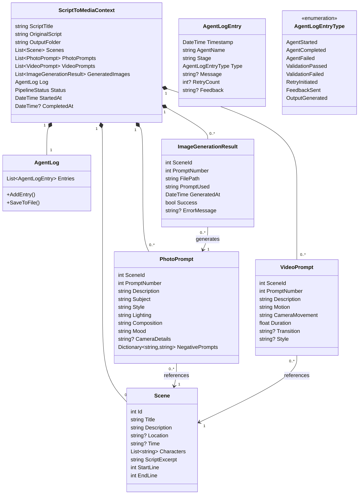
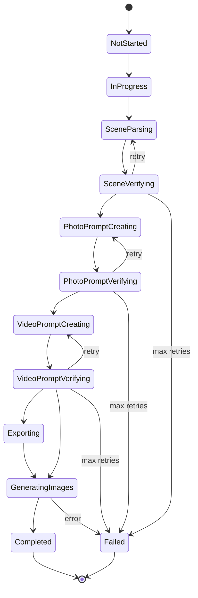

# Context Schema

Shared data structures and contracts for the multi-agent pipeline.

---

## Entity Relationship Diagram



---

## ScriptToMediaContext

The central context object passed through the entire pipeline.

```csharp
public class ScriptToMediaContext
{
    // Input
    public string ScriptTitle { get; set; }
    public string OriginalScript { get; set; }
    public string OutputFolder { get; set; }

    // Stage 1: Scenes
    public List<Scene> Scenes { get; set; }
    public SceneValidationResult? SceneValidation { get; set; }
    public int SceneRetryCount { get; set; }

    // Stage 2: Photo Prompts
    public List<PhotoPrompt> PhotoPrompts { get; set; }
    public PhotoPromptValidationResult? PhotoPromptValidation { get; set; }
    public int PhotoPromptRetryCount { get; set; }

    // Stage 3: Video Prompts
    public List<VideoPrompt> VideoPrompts { get; set; }
    public VideoPromptValidationResult? VideoPromptValidation { get; set; }
    public int VideoPromptRetryCount { get; set; }
    
    // Stage 4: Generation
    public List<ImageGenerationResult> GeneratedImages { get; set; }

    // Logging
    public AgentLog Log { get; set; }

    // Metadata
    public DateTime StartedAt { get; set; }
    public DateTime? CompletedAt { get; set; }
    public PipelineStatus Status { get; set; }
    public List<string> Errors { get; set; }
}
```

---

## AgentLog

Captures detailed agent execution history for debugging and auditing.

```csharp
public class AgentLog
{
    public List<AgentLogEntry> Entries { get; set; } = new();
    
    public void AddEntry(string agentName, string stage, AgentLogEntryType type, 
        string? message = null, int? retryCount = null, string? feedback = null)
    {
        Entries.Add(new AgentLogEntry
        {
            Timestamp = DateTime.UtcNow,
            AgentName = agentName,
            Stage = stage,
            Type = type,
            Message = message,
            RetryCount = retryCount,
            Feedback = feedback
        });
    }
    
    public async Task SaveToFileAsync(string filePath)
    {
        var markdown = GenerateMarkdown();
        await File.WriteAllTextAsync(filePath, markdown);
    }
    
    private string GenerateMarkdown()
    {
        // Generates formatted markdown with tables for each stage
        // Includes timestamps, retry details, feedback messages
    }
}

public class AgentLogEntry
{
    public DateTime Timestamp { get; set; }
    public string AgentName { get; set; }
    public string Stage { get; set; }
    public AgentLogEntryType Type { get; set; }
    public string? Message { get; set; }
    public int? RetryCount { get; set; }
    public string? Feedback { get; set; }
}

public enum AgentLogEntryType
{
    AgentStarted,
    AgentCompleted,
    AgentFailed,
    ValidationPassed,
    ValidationFailed,
    RetryInitiated,
    FeedbackSent,
    OutputGenerated
}
```

### Example agent-log.md Output

```markdown
# Agent Execution Log

**Script**: My Script  
**Started**: 2026-02-23 14:30:00  
**Completed**: 2026-02-23 14:35:22  
**Status**: Completed

## Stage 1: Scene Processing

| Time | Agent | Event | Details |
|------|-------|-------|---------|
| 14:30:01 | SceneParser | Started | Processing 5000 char script |
| 14:30:15 | SceneParser | Completed | Generated 12 scenes |
| 14:30:16 | SceneVerifier | Started | Validating 12 scenes |
| 14:30:20 | SceneVerifier | ValidationFailed | Scene 3 missing location |
| 14:30:20 | SceneVerifier | FeedbackSent | "Add location for scene 3" |
| 14:30:21 | SceneParser | Retry #1 | Applying feedback |
| 14:30:35 | SceneParser | Completed | Generated 12 scenes (revised) |
| 14:30:36 | SceneVerifier | Started | Validating 12 scenes |
| 14:30:42 | SceneVerifier | ValidationPassed | All scenes valid ✓ |

## Stage 2: Photo Prompt Creation
...
```

---

## Scene

Represents a single scene parsed from the script.

```csharp
public class Scene
{
    public int Id { get; set; }              // 1-based scene number
    public string Title { get; set; }        // Auto-generated or from script
    public string Description { get; set; }  // What happens in this scene
    public string? Location { get; set; }    // Where it takes place
    public string? Time { get; set; }        // Time of day / period
    public List<string> Characters { get; set; }  // Characters in scene
    public string ScriptExcerpt { get; set; } // Original text from script
    public int StartLine { get; set; }       // Line number in original script
    public int EndLine { get; set; }         // Line number in original script
}
```

---

## SceneValidationResult

Result from Scene Verifier agent.

```csharp
public class SceneValidationResult
{
    public bool IsValid { get; set; }
    public List<string> Errors { get; set; }
    public List<string> Suggestions { get; set; }
    public string? FeedbackToParser { get; set; }  // Specific instructions for retry
}
```

---

## PhotoPrompt

Detailed image generation prompt for a scene.

```csharp
public class PhotoPrompt
{
    public int SceneId { get; set; }         // References Scene.Id
    public int PromptNumber { get; set; }    // 1-based (multiple prompts per scene)
    public string Description { get; set; }  // Full prompt text for AI image gen
    public string Subject { get; set; }      // Main subject
    public string Style { get; set; }        // Art style, visual style
    public string Lighting { get; set; }     // Lighting description
    public string Composition { get; set; }  // Framing, angle, composition
    public string Mood { get; set; }         // Emotional tone
    public string? CameraDetails { get; set; } // Camera type, lens, settings
    public string? ColorPalette { get; set; }  // Dominant colors
    public Dictionary<string, string> NegativePrompts { get; set; } // What to avoid
}
```

---

## PhotoPromptValidationResult

Result from Photo Prompt Verifier agent.

```csharp
public class PhotoPromptValidationResult
{
    public bool IsValid { get; set; }
    public List<string> Errors { get; set; }
    public List<string> ConsistencyIssues { get; set; }  // Cross-scene issues
    public string? FeedbackToCreator { get; set; }
}
```

---

## VideoPrompt

Video generation prompt for a scene.

```csharp
public class VideoPrompt
{
    public int SceneId { get; set; }         // References Scene.Id
    public int PromptNumber { get; set; }    // 1-based (multiple prompts per scene)
    public string Description { get; set; }  // Full prompt text for AI video gen
    public string Motion { get; set; }       // What moves and how
    public string CameraMovement { get; set; } // Pan, tilt, zoom, dolly, etc.
    public float Duration { get; set; }      // Suggested duration in seconds
    public string? Transition { get; set; }  // Transition to next scene
    public string? Style { get; set; }       // Visual style (should match photo)
}
```

---

## VideoPromptValidationResult

Result from Video Prompt Verifier agent.

```csharp
public class VideoPromptValidationResult
{
    public bool IsValid { get; set; }
    public List<string> Errors { get; set; }
    public List<string> TechnicalIssues { get; set; }  // Feasibility concerns
    public string? FeedbackToCreator { get; set; }
}
```

---

## ImageGenerationResult

Tracks generated image output.

```csharp
public class ImageGenerationResult
{
    public int SceneId { get; set; }
    public int PromptNumber { get; set; }
    public string FilePath { get; set; }     // Path to saved image
    public string PromptUsed { get; set; }   // Prompt that generated this
    public DateTime GeneratedAt { get; set; }
    public TimeSpan GenerationTime { get; set; }
    public bool Success { get; set; }
    public string? ErrorMessage { get; set; }
}
```

---

## PipelineStatus

Overall pipeline execution status.

```csharp
public enum PipelineStatus
{
    NotStarted,
    InProgress,
    SceneParsing,
    SceneVerifying,
    PhotoPromptCreating,
    PhotoPromptVerifying,
    VideoPromptCreating,
    VideoPromptVerifying,
    Exporting,
    GeneratingImages,
    Completed,
    Failed
}
```

---

## Pipeline State Transitions



---

## Agent Result Pattern

Standard result type for agent operations.

```csharp
public class AgentResult<T>
{
    public bool Success { get; set; }
    public T? Data { get; set; }
    public List<string> Errors { get; set; }
    public List<string> Warnings { get; set; }
    public TimeSpan ExecutionTime { get; set; }
    
    // Helper methods
    public static AgentResult<T> Ok(T data) => new() { Success = true, Data = data };
    public static AgentResult<T> Fail(string error) => new() { Success = false, Errors = { error } };
}
```

---

## Validation Result Pattern

Standard result type for verification operations.

```csharp
public class ValidationResult
{
    public bool IsValid { get; set; }
    public List<string> Errors { get; set; }
    public List<string> Warnings { get; set; }
    public string? Feedback { get; set; }  // Instructions for correction
    public int? RetryCount { get; set; }
    
    // Helper methods
    public static ValidationResult Pass() => new() { IsValid = true };
    public static ValidationResult Fail(string error, string? feedback = null) 
        => new() { IsValid = false, Errors = { error }, Feedback = feedback };
}
```

---

## JSON Example: Full Context

```json
{
  "OriginalScript": "FADE IN:\n\nEXT. PARK - DAY\n\nJohn walks through the park...",
  "Scenes": [
    {
      "Id": 1,
      "Title": "John in the Park",
      "Description": "John walks through a sunny park, looking contemplative",
      "Location": "EXT. PARK",
      "Time": "DAY",
      "Characters": ["John"],
      "ScriptExcerpt": "EXT. PARK - DAY\n\nJohn walks through the park...",
      "StartLine": 1,
      "EndLine": 15
    }
  ],
  "SceneValidation": {
    "IsValid": true,
    "Errors": [],
    "Suggestions": []
  },
  "SceneRetryCount": 0,
  "PhotoPrompts": [
    {
      "SceneId": 1,
      "PromptNumber": 1,
      "Description": "A man in his 30s walking through a sunlit urban park...",
      "Subject": "John, male, 30s, casual clothing",
      "Style": "Cinematic, realistic",
      "Lighting": "Natural sunlight, dappled through trees",
      "Composition": "Medium wide shot, rule of thirds",
      "Mood": "Contemplative, peaceful",
      "CameraDetails": "35mm lens, f/2.8",
      "ColorPalette": "Green, gold, earth tones",
      "NegativePrompts": {
        "avoid": "cartoons, anime, blurry, distorted"
      }
    }
  ],
  "PhotoPromptValidation": {
    "IsValid": true,
    "Errors": [],
    "ConsistencyIssues": []
  },
  "PhotoPromptRetryCount": 0,
  "VideoPrompts": [
    {
      "SceneId": 1,
      "PromptNumber": 1,
      "Description": "Slow tracking shot following John walking...",
      "Motion": "John walking at leisurely pace",
      "CameraMovement": "Slow lateral tracking shot",
      "Duration": 5.0,
      "Transition": "Fade to next scene",
      "Style": "Cinematic, realistic"
    }
  ],
  "VideoPromptValidation": {
    "IsValid": true,
    "Errors": [],
    "TechnicalIssues": []
  },
  "VideoPromptRetryCount": 0,
  "GeneratedImages": [],
  "StartedAt": "2026-02-23T10:00:00Z",
  "CompletedAt": null,
  "Status": "InProgress",
  "Errors": []
}
```

---

## Notes

- All collections should be initialized as empty lists (not null)
- Nullable reference types enabled
- All models should be serializable to/from JSON
- Include data annotations for validation where applicable
